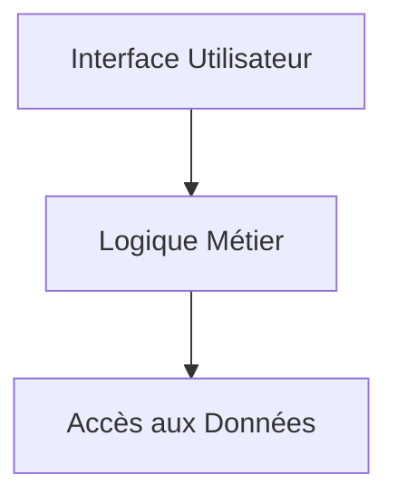
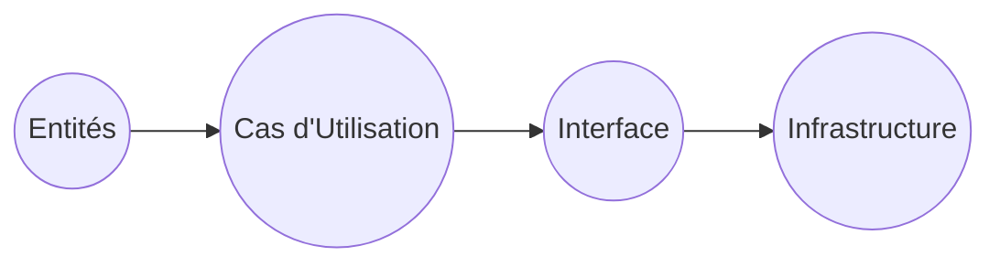

# Introduction à l'Architecture Logicielle

## Qu'est-ce que l'architecture logicielle ?

L'architecture logicielle est la structure fondamentale d'un logiciel, décrivant comment les différents composants du système sont organisés et interagissent entre eux. Elle agit comme un plan directeur qui définit l'agencement des modules, leurs responsabilités et les relations entre eux, facilitant ainsi la compréhension, la maintenance et l'évolution du logiciel.

### Définition précise

Selon Wikipédia, l'architecture logicielle décrit d'une manière symbolique et schématique les éléments d'un ou plusieurs systèmes informatiques, ainsi que leurs interactions. Elle permet de structurer un logiciel de manière claire pour répondre aux besoins fonctionnels et non fonctionnels (performance, sécurité, évolutivité, maintenabilité, etc.)[^1].

Claranet précise que l'architecture logicielle est la manière dont un logiciel est conçu, autrement dit comment ses différents éléments sont assemblés pour fonctionner efficacement ensemble[^2].

### Pourquoi une architecture logicielle ?

- **Modularité** : Répartition claire des responsabilités.
- **Réutilisabilité** : Meilleure exploitation du code existant.
- **Maintenabilité** : Simplification des modifications et corrections.
- **Scalabilité** : Adaptation facilitée à la croissance des besoins.
- **Robustesse** : Gestion anticipée des contraintes et des erreurs.

### Exemple simple : Application de gestion de bibliothèque

Imaginons une application de gestion de bibliothèque avec trois grands composants :

1. **Interface utilisateur (UI)** : permet aux utilisateurs d'emprunter ou de rendre des livres.
2. **Logique métier (Business Logic)** : règles sur l'emprunt, la réservation, les pénalités.
3. **Accès aux données (Data Access)** : interactions avec la base de données pour stocker et récupérer les informations.

Ces composants peuvent être définis et séparés dans l'architecture logicielle, chacun avec son rôle spécifique.

Dans ce diagramme, l'interface utilisateur communique uniquement avec la logique métier, qui elle-même accède aux données, établissant clairement les dépendances.

### Exemples d'architectures classiques

- **Architecture monolithique** : Tout le code est dans une seule application. Simple à démarrer mais difficile à scaler.
- **Architecture en couches** : Séparation stricte entre les couches (ex. présentation, business, données).
- **Microservices** : Collection de services indépendants, facilitant la scalabilité et la maintenance.

---

## Introduction à la Clean Architecture

La Clean Architecture, popularisée par Robert C. Martin (Uncle Bob), est un style d'architecture qui vise à maintenir la souplesse et la durée de vie du logiciel en isolant les règles métier des détails techniques comme les bases de données, les frameworks ou l'interface utilisateur.

Elle repose sur plusieurs principes dont :

- **Indépendance des frameworks** : Le code métier ne dépend pas de la couche technique.
- **Testabilité** : Tous les composants métier peuvent être testés indépendamment.
- **Indépendance de l’interface utilisateur** : L’interface peut être modifiée sans impacter la logique métier.

Son organisation est souvent représentée par des cercles concentriques, où :

- Au centre, se trouvent les entités (règles métier).
- Autour, la logique d'application.
- Plus à l'extérieur, les interfaces et infrastructures.

---

## Sources et références

[^1]: [Wikipédia - Architecture logicielle](https://fr.wikipedia.org/wiki/Architecture_logicielle)  
[^2]: [Claranet - Architecture logicielle](https://www.claranet.com/fr/blog/architecture-logicielle/)  
[^3]: [Mygiciel - Guide architecture logicielle](https://www.mygiciel.com/architecture-logicielle/architecture-logicielle-guide-sur-la-conception-de-larchitecture-des-logiciels-personnalises/)  
[^4]: [Techno-Science - Architecture logicielle](https://www.techno-science.net/glossaire-definition/Architecture-logicielle.html)

---

En résumé, comprendre l'architecture logicielle permet de concevoir des systèmes robustes, évolutifs et maintenables, essentiels pour les projets complexes actuels. La Clean Architecture va plus loin en proposant une organisation qui garantit cette qualité sur le long terme en séparant les préoccupations selon un schéma bien défini.