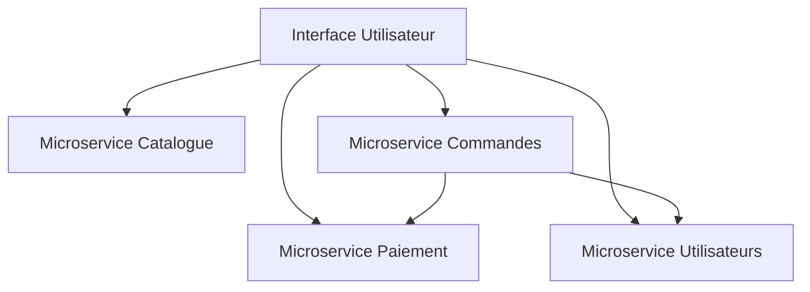

# Rôle et responsabilités de l'architecte logiciel dans un projet de développement complexe

## Introduction

Dans les projets de développement logiciel complexes, l'architecte logiciel joue un rôle central qui dépasse la simple écriture de code. Il est le garant de la qualité architecturale, de la cohérence technique et de la bonne évolution du système tout au long du projet.

---

## Qu’est-ce qu’un architecte logiciel ?

L'architecte logiciel est un professionnel qui conçoit la structure globale d’une application ou d’un système. Il traduit les besoins fonctionnels et non fonctionnels en une architecture robuste et évolutive, qui guide les équipes de développement.

---

## Responsabilités principales

### 1. Conception de l'architecture

L'architecte définit la structure technique du système notamment :

- Choix des technologies et des frameworks.
- Définition des modules, composants, et interfaces.
- Organisation des flux de données et communication entre composants.

### 2. Garantir la qualité et la cohérence technique

Il veille à ce que le modèle architectural reste fidèle aux besoins fonctionnels et techniques au fil du temps. Il s’assure que les équipes respectent les normes et les bonnes pratiques architecturales, notamment pour :

- La maintenabilité.
- La scalabilité.
- La sécurité.
- La performance.

### 3. Coordination et pilotage technique

En étroite collaboration avec les chefs de projet, devOps, développeurs et autres parties prenantes, l’architecte :

- Anticipe les risques techniques.
- Évalue les impacts des choix sur le projet.
- Participe à la planification et à l’estimation des ressources.
- Facilite la communication entre équipes.

### 4. Accompagnement et conseil

- Partage des connaissances et formations sur l'architecture.
- Revue de code et audit architectural.
- Conseil lors de l’intégration de nouvelles technologies.

---

## Illustration du rôle dans un projet complexe

Imaginons un projet de plateforme e-commerce distribuée avec plusieurs équipes travaillant sur :

- Le catalogue produit.
- Le service de paiement.
- La gestion des utilisateurs.
- Le traitement des commandes.

L’architecte doit :

- Concevoir une architecture en microservices ou en modules émancipés.
- S’assurer que les équipes respectent les interfaces définies.
- Gérer les échanges entre services.
- Anticiper les besoins de scalabilité selon la charge.

---

## Compétences clés de l’architecte logiciel

- **Compréhension fonctionnelle et technique** : bonne maîtrise des besoins métier comme des technologies.
- **Vision systémique** : comprendre les interactions et la globalité du projet.
- **Communication** : aptitude à fédérer et traduire les besoins entre équipes métier et technique.
- **Pragmatisme** : capacité à équilibrer exigences et contraintes de temps/coût.
- **Veille technologique** : connaître les nouvelles tendances pour adapter l'architecture.

---

## Synthèse

| Rôle                           | Principales responsabilités                                   |
|-------------------------------|-------------------------------------------------------------|
| Concepteur de l’architecture   | Choix techniques, structuration, modélisation                |
| Garant technique                | Qualité, normes, cohérence, bonne pratiques                   |
| Coordonnateur                  | Communication, planification, gestion des risques             |
| Conseiller et accompagnateur   | Formations, audits, conseils techniques                        |

---

## Sources utilisées

- [IB-Formation - Fiche métier Architecte logiciel](https://www.ib-formation.fr/fiches-metiers/metiers-du-developpement/architecte-en-solution-logicielle)  
- [Solutions Connect IT - Architecte logiciel : optimisez vos systèmes informatiques](https://solutionsconnectit.com/architecte-logiciel-optimisez-vos-systemes-informatiques/)  
- [ESIEA - Architecte logiciel](https://www.esiea.fr/architecte-logiciel/)  
- [LinkedIn - Le métier d'architecte logiciel par Yves Richard](https://fr.linkedin.com/pulse/le-m%C3%A9tier-darchitecte-logiciel-conception-et-au-c%C5%93ur-de-yves-richard)  
- [Powo - Le maître d'œuvre numérique : l'architecte logiciel](https://www.po-wo.fr/architecte-logiciel-guide/)  

