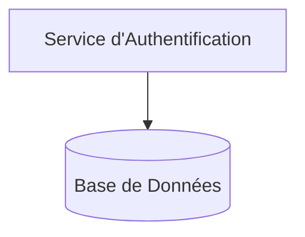
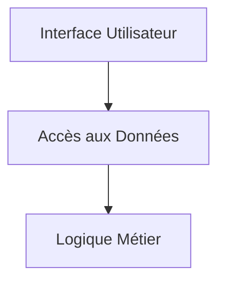
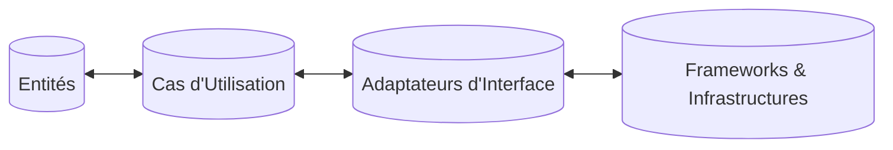

# Les Problèmes Résolus par la Clean Architecture

## Identification des problèmes courants dans les architectures logicielles traditionnelles

Les architectures logicielles traditionnelles rencontrent fréquemment des difficultés qui impactent la qualité, la maintenabilité et l’évolutivité des applications. Parmi ces problèmes, deux sont particulièrement récurrents :

- **Le couplage fort (tight coupling)**
- **Les dépendances non contrôlées (dependency management issues)**

---

## 1. Le couplage fort

Le couplage fort se produit lorsque les composants d’un logiciel sont excessivement dépendants les uns des autres. Cela signifie que modifier un composant impacte souvent plusieurs autres, ce qui complique les évolutions et les tests.

### Conséquences du couplage fort

- **Maintenance difficile** : Toute modification est risquée car elle peut provoquer des effets de bord non anticipés.
- **Faible testabilité** : Tester un module isolément est complexe car il requiert de nombreuses dépendances.
- **Rigidité** : Impossibilité de remplacer ou d’améliorer un composant sans toucher l’ensemble.

### Exemple classique

Un service d’authentification directement couplé à une base de données spécifique sans abstraction :

Ici, AuthService dépend directement d’une technologie spécifique de base de données, ce qui rend difficile un changement futur vers un autre système ou une modification sans impact lourd.

---

## 2. Les dépendances non contrôlées

Dans de nombreux projets, les dépendances entre modules ou couches ne sont pas strictement encadrées. Cela mène à :

- **Des dépendances directionnelles incorrectes** : Les couches hautes dépendant directement des couches basses, ou encore des modules de présentation dépendant de la base de données.
- **Risque d’effet boule de neige** lors des modifications.
- **Violation du principe d’inversion de dépendance (Dependency Inversion Principle, DIP)**, un pilier de la programmation orientée objet.

### Illustration typique

Dans ce schéma, l'interface utilisateur accède directement à la couche d'accès aux données, violant de bonnes pratiques d'architecture où la logique métier devrait gérer l'accès aux données.

---

## Comment la Clean Architecture répond à ces problèmes

La Clean Architecture structure le logiciel en couches concentriques où :

- Les dépendances pointent toujours vers l’intérieur (vers les règles métier).
- Les couches externes (interfaces, infrastructure) dépendent des couches internes via des abstractions.
- Le couplage entre modules est faible et géré via des interfaces.

### Modèle simplifié de la Clean Architecture

Les flèches indiquent les dépendances, toujours dirigées de l’extérieur vers l’intérieur. Ainsi :

- Le code métier (Entities) ne dépend d’aucune technologie.
- L’interface utilisateur et la base de données sont traitées comme des détails.

---

## Exemples concrets

- **Sans Clean Architecture** : Une modification dans la base de données peut nécessiter des changements dans toute l'application.
- **Avec Clean Architecture** : En changeant la base de données, seul l'adaptateur d'infrastructure est impacté, sans toucher au cœur métier.

---

## Sources utilisées

- [Robert C. Martin - The Clean Architecture](https://8thlight.com/blog/uncle-bob/2012/08/13/the-clean-architecture.html)  
- [Medium - Common Software Architecture Problems and Clean Architecture Solutions](https://medium.com/swlh/common-problems-of-software-architecture-coupling-and-how-clean-architecture-addresses-them-8823b3a410e5)  
- [Martin Fowler - Dependency Injection](https://martinfowler.com/articles/injection.html)  
- [InfoQ - Clean Architecture Overview](https://www.infoq.com/articles/clean-architecture-summary/)  
- [DZone - Why Modern Software Architecture Matters](https://dzone.com/articles/why-modern-software-architecture-matters-to-you)  

---

En bref, le couplage fort et les dépendances non contrôlées limitent sévèrement la flexibilité des logiciels traditionnels. La Clean Architecture propose une organisation claire basée sur des principes solides qui réduisent ces problèmes, améliorant ainsi la maintenabilité, la testabilité et l’évolutivité des systèmes.