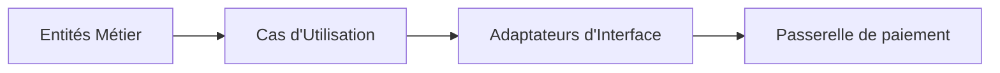
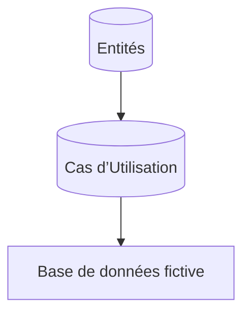

# Pourquoi la Clean Architecture ? Les bénéfices attendus

La Clean Architecture, conçue par Robert C. Martin (Uncle Bob), répond à des problématiques courantes des architectures logicielles traditionnelles en offrant plusieurs bénéfices clés : **maintenabilité, testabilité et flexibilité**. Ces avantages soutiennent la qualité et la pérennité des applications.

---

## 1. Maintenabilité

### En quoi consiste la maintenabilité ?

La maintenabilité désigne la facilité avec laquelle un logiciel peut être modifié pour corriger des erreurs, améliorer des fonctionnalités ou s’adapter à de nouveaux besoins.

### Comment la Clean Architecture favorise la maintenabilité ?

- **Séparation stricte des responsabilités** : Les différentes couches (entités, cas d’usage, interface, infrastructure) sont définies clairement, ce qui limite les effets de bord lors des modifications.
- **Indépendance des détails techniques** : Le coeur métier ne dépend pas des frameworks, base de données, ou UI, réduisant les risques liés à l’évolution des technologies externes.
- **Modularité** : Chaque couche peut évoluer indépendamment.

### Exemple concret

Une application e-commerce avec un module de paiement peut changer sa solution de paiement sans affecter la logique métier grâce aux abstractions propres à la Clean Architecture.

Changer **PaymentGateway** ne demande aucune modification aux entités ou aux cas d’utilisation.

---

## 2. Testabilité

### Pourquoi la testabilité est importante ?

La testabilité facilite l’écriture de tests unitaires et d’intégration, condition indispensable pour garantir la qualité du logiciel.

### Apport de la Clean Architecture

- Les couches internes sont isolées des couches externes par des interfaces, ce qui permet de facilement injecter des dépendances factices (mocks) pour les tests.
- La logique métier étant découplée de l’interface utilisateur et de la base de données, elle peut être testée indépendamment.

### Illustration

Tester les règles métier uniquement :

Les tests peuvent simuler les accès aux données sans déployer l’infrastructure réelle.

---

## 3. Flexibilité

### Définition

La flexibilité désigne la capacité d’un système à s’adapter rapidement aux changements fonctionnels ou technologiques sans refonte majeure.

### Contribution de la Clean Architecture

- **Dépendances inversées** : Le principe d’inversion de dépendance garantit que le code de haut niveau ne dépend pas du code de bas niveau, facilitant le remplacement des implémentations techniques.
- **Découplage fort entre les couches** : Par exemple, la couche UI peut être refaite avec un autre framework sans impacter le coeur métier.

### Cas pratique

Une application mobile utilisant React Native pour l’interface peut changer pour Flutter sans modifier la logique métier qui est en couches internes indépendantes.

---

## Résumé des bénéfices

| Bénéfices     | Explication                                | Exemple                                  |
|---------------|--------------------------------------------|-----------------------------------------|
| Maintenabilité | Séparation claire des responsabilités      | Changer la base de données sans impact  |
| Testabilité    | Couche métier testable indépendamment      | Tests unitaires avec mocks               |
| Flexibilité    | Adaptation aisée aux technologies externes | Réécrire l’UI sans toucher à la logique |

---

## Sources utilisées

- [Robert C. Martin - The Clean Architecture](https://8thlight.com/blog/uncle-bob/2012/08/13/the-clean-architecture.html)  
- [Medium - Why Clean Architecture Matters](https://medium.com/authority-magazine/why-clean-architecture-matters-4bd7c4960490)  
- [InfoQ - Clean Architecture Explained](https://www.infoq.com/articles/clean-architecture-summary/)  
- [DZone - Benefits of Clean Architecture](https://dzone.com/articles/how-clean-architecture-benefits-your-software-pro)  
- [Stack Overflow Blog - Practical Software Architecture](https://stackoverflow.blog/2022/01/10/architectural-principles-that-make-software-systems-successful/)  

