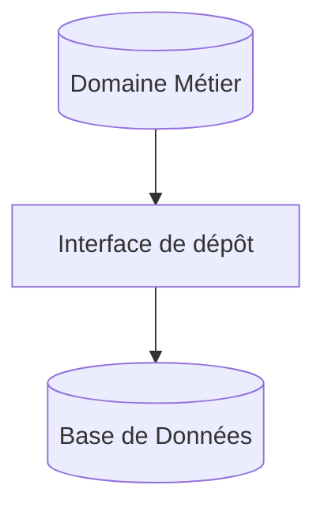
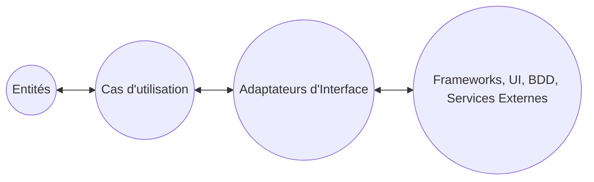

# Principes Fondamentaux de la Clean Architecture  
## Indépendance des Frameworks, de l'UI, de la Base de Données et des Agences Externes

L’un des piliers essentiels de la Clean Architecture, proposée par Robert C. Martin (Uncle Bob), est **l’indépendance vis-à-vis des frameworks, interfaces utilisateurs, bases de données et services externes**. Cette indépendance améliore la robustesse, la maintenabilité et la flexibilité des systèmes logiciels.

---

## 1. Indépendance des frameworks

Les frameworks (ex : Spring, Angular, Django) fournissent des outils facilitant le développement, mais leur présence ne devrait pas « polluer » la logique métier ni dicter la conception globale.

### Pourquoi éviter la dépendance directe aux frameworks ?

- **Évolution indépendante** : Le cœur métier doit pouvoir évoluer sans dépendre des mises à jour ou contraintes du framework.
- **Portabilité** : Changer de framework sans réécrire entièrement la logique métier.
- **Testabilité** : Limiter les dépendances externes facilite l’écriture de tests unitaires rapides.

---

## 2. Indépendance de l’Interface Utilisateur (UI)

La UI est souvent sujette à changement rapide (refonte design, migration technologies). L’architecture doit permettre de la remplacer sans refondre la logique métier.

### Conséquence

La logique métier est placée au centre, avec la UI en périphérie, interagissant via des interfaces.

---

## 3. Indépendance de la base de données

L’accès aux données est un détail d’implémentation. La Clean Architecture sépare la logique métier des opérations de persistance par le biais d’abstractions.

### Avantages

- Changer de technologie de base (SQL, NoSQL) sans modifier la logique.
- Faciliter la simulation des accès pour les tests unitaires.

---

## 4. Indépendance des agences externes (services tiers)

Les appels vers des API externes, services tiers, ou microservices doivent être encapsulés derrière des interfaces locales.

### Bénéfice

L’architecture devient résistante aux changements externes (modification API, indisponibilité service), en limitant leur impact au seul adaptateur.

---

## Schéma global d’indépendance dans la Clean Architecture

Les flèches indiquent le sens des dépendances, **toujours dirigées vers l'intérieur**, garantissant ainsi que :

- Le cœur métier ne dépend d’aucun détail externe.
- Les détails (UI, bases, frameworks) dépendent de l’abstraction du domaine.

---

## Illustration pratique

Dans une application de gestion, le module d'authentification:

- Contient les règles métier au centre (validation des identifiants, gestion des sessions).
- Utilise une interface d'authentification.
- Les implémentations concrètes utilisent soit un service OAuth, soit une base de données locale, sans affecter le cœur.

---

## Sources

- [Uncle Bob - The Clean Architecture](https://8thlight.com/blog/uncle-bob/2012/08/13/the-clean-architecture.html)  
- [Martin Fowler - Patterns of Enterprise Application Architecture](https://martinfowler.com/eaaCatalog/)  
- [InfoQ - Clean Architecture Explained](https://www.infoq.com/articles/clean-architecture-summary/)  
- [Medium - Principles of Clean Architecture](https://medium.com/swlh/common-problems-of-software-architecture-coupling-and-how-clean-architecture-addresses-them-8823b3a410e5)  

---

En conclusion, l’indépendance vis-à-vis des frameworks, interfaces utilisateurs, bases de données et services externes assure une architecture modulaire, évolutive et robuste. Elle rend possible l’adaptation rapide aux changements technologiques sans compromettre la logique métier.