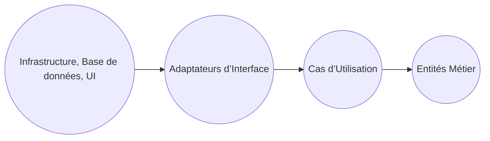
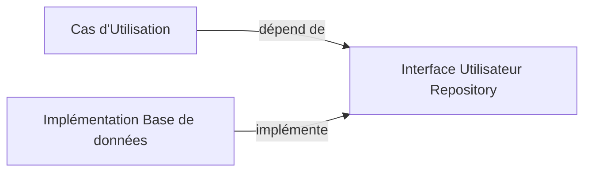

# Les règles de dépendance dans la Clean Architecture

La Clean Architecture, conçue pour structurer les systèmes logiciels de manière durable et maintenable, repose sur des **règles de dépendance** précises. Ces règles définissent le sens des dépendances entre différentes couches du système, garantissant une architecture robuste, modulaire et flexible.

---

## 1. Principe fondamental : la dépendance pointe toujours vers l’intérieur

La règle majeure de la Clean Architecture est que **les dépendances doivent toujours aller des couches externes vers les couches internes**. Concrètement, cela signifie que les couches centrales (entités ou règles métier) ne dépendent d’aucune couche externe (comme l’interface utilisateur, la base de données ou les frameworks), tandis que ces dernières peuvent dépendre des abstractions définies par les couches internes.

### Illustration simple

Les flèches indiquent le sens des dépendances, toujours dirigé vers le centre (les entités).

---

## 2. Les raisons de cette règle

- **Indépendance du domaine métier** : Le code métier ne doit pas être affecté par des changements techniques ou de présentation.
- **Isolation des détails techniques** : Les frameworks, bases de données ou UI peuvent évoluer ou être remplacés sans impact sur la logique métier.
- **Facilitation des tests** : La logique métier étant découplée, elle peut être testée en isolation.

---

## 3. Principes associés : principes SOLID et inversion des dépendances

La Clean Architecture applique largement **le principe d’inversion des dépendances (Dependency Inversion Principle - DIP)**, qui stipule que :

- Les modules de haut niveau ne doivent pas dépendre des modules de bas niveau.
- Les deux doivent dépendre des abstractions (interfaces).
- Les abstractions ne doivent pas dépendre des détails, ce sont les détails qui dépendent des abstractions.

---

## 4. Exemple concret

Considérons une application de gestion des commandes :

- **Entités** : classes représentant les commandes et règles métier.
- **Cas d’utilisation** : la logique des traitements (validation, traitement, livraison).
- **Interface utilisateur** : application Web ou mobile.
- **Infrastructure** : base de données, systèmes externes.

Si la couche d’infrastructure doit changer de SGBD, rien dans les entités ou cas d’utilisation ne doit être modifié. L’infrastructure implémente uniquement les interfaces définies par les couches internes.

---

## 5. Respecter les règles de dépendance avec des interfaces

Les couches externes accèdent aux couches internes via des **interfaces abstraites**. Par exemple :

La dépendance va du UseCase vers IUserRepository (interface), tandis que l’implémentation spécifique dépend de cette interface. Ceci découple la logique métier des détails techniques.

---

## 6. Synthèse

| Règle de dépendance                      | Effet                                                      |
|-----------------------------------------|------------------------------------------------------------|
| Dépendances toujours dirigées vers l’intérieur | Séparation claire entre logique métier et détails          |
| Utilisation d’abstractions pour les dépendances | Permet substitution/évolution des technologies sans impact |
| Suivi du principe d’inversion de dépendance    | Garantie de la modularité et testabilité                    |

---

## Sources utilisées

- [Robert C. Martin - The Clean Architecture](https://8thlight.com/blog/uncle-bob/2012/08/13/the-clean-architecture.html)  
- [Martin Fowler - Dependency Inversion Principle](https://martinfowler.com/bliki/DependencyInversionPrinciple.html)  
- [InfoQ - Clean Architecture Summary](https://www.infoq.com/articles/clean-architecture-summary/)  
- [Medium - Clean Architecture Principles](https://medium.com/@georgecheng/clean-architecture-principles-92d914fc7e5a)  

---

Respecter ces règles de dépendance est une condition sine qua non pour construire des logiciels durables, testables, et facilement évolutifs. L’architecture ainsi pensée garantit que les couches internes restent isolées des changements techniques et technologiques, réduisant la dette technique et facilitant la maintenance.