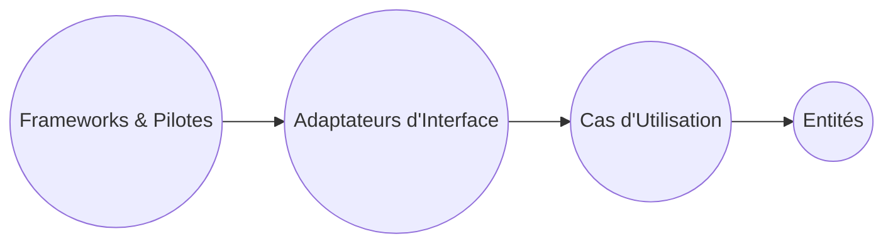

# Les couches de la Clean Architecture : Entités, Cas d'Utilisation, Adaptateurs d'Interface, Frameworks & Pilotes

La Clean Architecture, proposée par Robert C. Martin, organise un système logiciel en plusieurs couches concentriques ayant chacune des responsabilités précises. Cette structuration garantit modularité, testabilité et indépendance technologique.

---

## 1. Entités (Entities)

### Définition
Les entités représentent les objets métier, les règles fondamentales du domaine, indépendamment de toute technologie.

### Rôle
- Encapsulent les règles métier les plus stables.
- Peuvent être des objets, structures ou classes qui ont une longue durée de vie.
- Indépendantes de la base de données, UI ou autres détails externes.

### Exemple
Dans une application bancaire, une entité pourrait être un objet **CompteBancaire** avec des règles métier comme « ne pas autoriser un solde négatif ».

---

## 2. Cas d’Utilisation (Use Cases / Interactors)

### Définition
Cette couche orchestre l’exécution des règles métier selon les besoins applicatifs spécifiques. Elle contient la logique de l’application qui décrit comment le système répond aux requêtes de l’utilisateur.

### Rôle
- Coordonne les flux métier.
- Implémente les règles de gestion spécifiques aux processus.
- Ne dépend pas de la présentation ni des infrastructures.

### Exemple
Dans un système de réservation, un cas d’utilisation peut être **RéserverUnVol** qui vérifie la disponibilité, réserve un siège et envoie la confirmation.

---

## 3. Adaptateurs d’Interface (Interface Adapters)

### Définition
Cette couche transforme les données entre les formats utilisés par la couche interne et ceux utilisés par les frameworks ou agents externes.

### Rôle
- Implémente les interfaces pour la présentation (ex: contrôleurs MVC).
- Convertit les données pour la base de données, services web, etc.
- Peut contenir les implémentations des interfaces définies par les cas d’utilisation.

### Exemple
Un adaptateur convertit des objets métier en JSON pour une API REST, ou des formulaires en objets métiers.

---

## 4. Frameworks et Pilotes (Frameworks & Drivers)

### Définition
Il s'agit de la couche la plus externe qui comprend les détails techniques : UI, base de données, pilotes matériels, services externes.

### Rôle
- Contient la technologie spécifique.
- Exécute les tâches comme l’accès aux données ou la gestion des interfaces utilisateur.
- Dépend des couches internes via des interfaces et abstractions.

---

## Schéma synthétique de la Clean Architecture

Les dépendances pointent toujours **vers l’intérieur**, vers le noyau métier.

---

## Exemple global : un système de gestion d'école

| Couche                   | Exemple concret                       |
|-------------------------|------------------------------------|
| Entités                 | Étudiant, Cours, Inscription       |
| Cas d'Utilisation       | Inscrire un étudiant à un cours     |
| Adaptateurs d'Interface | API REST exposant les opérations    |
| Frameworks & Pilotes    | Framework web, base de données SQL  |

Ainsi, une modification du framework web (ex: migration de Angular vers React) ne touche pas la logique métier.

---

## Sources

- [Uncle Bob - The Clean Architecture](https://8thlight.com/blog/uncle-bob/2012/08/13/the-clean-architecture.html)  
- [InfoQ - Summary of Clean Architecture](https://www.infoq.com/articles/clean-architecture-summary/)  
- [Martin Fowler - Layers](https://martinfowler.com/eaaCatalog/layers.html)  
- [Medium - Understanding Clean Architecture](https://medium.com/@peyyo/understanding-clean-architecture-8b544dbb8570)  

---

## Conclusion

La Clean Architecture organise le logiciel en couches indépendantes et bien définies, du cœur métier aux détails techniques. Cette organisation assure une grande flexibilité, rend les tests plus simples et facilite la maintenance en isolant les préoccupations.