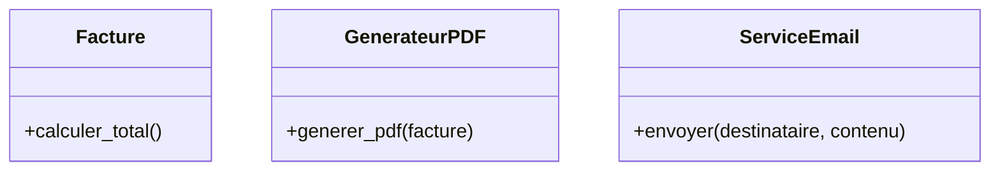

# Le Principe de Responsabilité Unique (SRP)

Le Principe de Responsabilité Unique (Single Responsibility Principle, ou SRP) est l’un des cinq piliers des principes SOLID en programmation orientée objet. Il vise à améliorer la clarté, la maintenabilité et la modularité du code en contraignant un module ou une classe à avoir une seule raison de changer.

---

## 1. Définition du SRP

Formulé initialement par Robert C. Martin (Uncle Bob), le SRP stipule que :

> **Une classe (ou module) doit avoir une, et une seule, raison de changer.**

Cela signifie que chaque classe doit se concentrer sur une seule responsabilité ou fonction dans le système. Quand une classe remplit plusieurs responsabilités, elle devient difficile à maintenir et sujette aux erreurs lors des modifications.

---

## 2. Exemples concrets

### Exemple 1 : violation du SRP

Supposons une classe `Facture` qui, en plus de gérer les données de facturation, s’occupe aussi de la génération du PDF de la facture et de son envoi par email :

```python
class Facture:
    def calculer_total(self):
        # Calcul total de la facture
        pass

    def generer_pdf(self):
        # Génère un PDF de la facture
        pass

    def envoyer_email(self, destinataire):
        # Envoie le PDF par email
        pass
```

**Problème** : cette classe a plusieurs raisons de changer — modification de la logique métier, changement du format PDF ou modification du mode d’envoi d’email.

---

### Exemple 2 : respect du SRP

En appliquant le SRP, on divise la classe en plusieurs :

```python
class Facture:
    def calculer_total(self):
        # Calcul total de la facture
        pass

class GenerateurPDF:
    def generer_pdf(self, facture):
        # Génère un PDF à partir de la facture
        pass

class ServiceEmail:
    def envoyer(self, destinataire, contenu):
        # Envoi d'email
        pass
```

Chaque classe a désormais une seule responsabilité claire, facilitant la maintenance et l’évolution.

---

## 3. Illustration



---

## 4. Avantages du SRP

- **Facilite la maintenance** : Modifications localisées.
- **Améliore la testabilité** : Classes plus simples à tester isolément.
- **Réduit les effets de bord** : Moins de risques de casser d’autres fonctionnalités.
- **Favorise la réutilisabilité** : Composants spécialisés peuvent être utilisés ailleurs.

---

## 5. Exemples complémentaires

- Une classe qui gère à la fois la logique métier et la persistance viole souvent le SRP.
- Dans un système de gestion utilisateurs, séparer les responsabilités de validation des données et de gestion de la base est plus conforme au SRP.

---

## Sources

- [Robert C. Martin - The Single Responsibility Principle](https://blog.cleancoder.com/uncle-bob/2014/05/08/SingleReponsibilityPrinciple.html)  
- [Martin Fowler - Single Responsibility Principle](https://martinfowler.com/bliki/SingleResponsibilityPrinciple.html)  
- [Medium - Understanding SRP with Examples](https://medium.com/@jasonekratz/the-single-responsibility-principle-srp-65bf6a94191f)  
- [Baeldung - SOLID Principles: SRP](https://www.baeldung.com/solid-principles#srp)  

