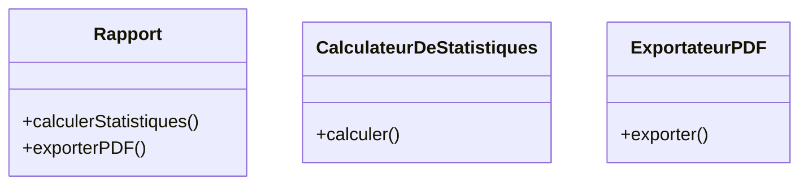
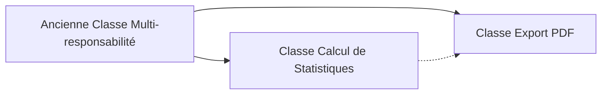

# Impact du Principe de Responsabilité Unique (SRP) sur la Cohésion et le Couplage

Le Principe de Responsabilité Unique (SRP) est un levier majeur pour améliorer la qualité architecturale d’un logiciel. En focalisant chaque classe ou module sur une seule responsabilité, le SRP agit directement sur deux notions clés en conception logiciel : **la cohésion** et **le couplage**.

---

## 1. Cohésion : renforcer la pertinence interne

### Définition

La cohésion mesure à quel point les éléments au sein d’un module appartiennent à une même fonctionnalité. Une cohésion élevée signifie que la classe ou le module fait un seul travail, ce qui facilite compréhension et maintenance.

### SRP et cohésion

Le SRP augmente la cohésion, car chaque classe ou module implémente une responsabilité claire et bien définie. Cela évite la multiplication de fonctionnalités hétérogènes dans une même entité.

### Exemple

Une classe `Rapport` qui calcule des statistiques et gère aussi l’export au format PDF a une cohésion faible. On préférera séparer ces responsabilités pour obtenir deux classes focalisées :

- `CalculateurDeStatistiques`
- `ExportateurPDF`



---

## 2. Couplage : réduire les dépendances externes

### Définition

Le couplage désigne le degré d’interdépendance entre modules ou classes. Un couplage faible est souhaitable pour que les modifications dans une partie n’impactent pas les autres.

### SRP et couplage

En appliquant le SRP, on évite que les responsabilités multiples mélangent les dépendances. Chaque module peut évoluer indépendamment, ce qui facilite l’évolution et la réutilisation.

---

### Exemple

Ici, la classe `Facture` a trois responsabilités : calcul, génération PDF, et envoi email, ce qui crée un couplage fort entre ces fonctionnalités.

```python
class Facture:
    def calculer_total(self):
        pass
    def generer_pdf(self):
        pass
    def envoyer_email(self, destinataire):
        pass
```

En la scindant selon SRP, chaque classe a moins de dépendances :

```python
class Facture:
    def calculer_total(self):
        pass

class GenerateurPDF:
    def generer_pdf(self, facture):
        pass

class ServiceEmail:
    def envoyer(self, destinataire, contenu):
        pass
```

---

## 3. Résumé relation SRP, cohésion, couplage

| Principe                   | Effet                                               |
|---------------------------|----------------------------------------------------|
| SRP                       | Une responsabilité par classe/module               |
| Cohésion                  | Augmentation : la classe fait un seul travail      |
| Couplage                  | Diminution : modules plus indépendants             |

---

## 4. Cohésion et Couplage améliorés par SRP



Après refactorisation, les dépendances non essentielles disparaissent, et chaque classe est autonome.

---

## Sources

- [Martin Fowler - Coupling and Cohesion](https://martinfowler.com/bliki/Coupling.html)  
- [Robert C. Martin - Single Responsibility Principle](https://blog.cleancoder.com/uncle-bob/2014/05/08/SingleReponsibilityPrinciple.html)  
- [GeeksforGeeks - Cohesion and Coupling](https://www.geeksforgeeks.org/cohesion-and-coupling-in-software-engineering/)  
- [Medium - How SRP improves Cohesion and Coupling](https://medium.com/@ashhitch/how-single-responsibility-principle-improves-code-quality-d84f62ea414b)  

