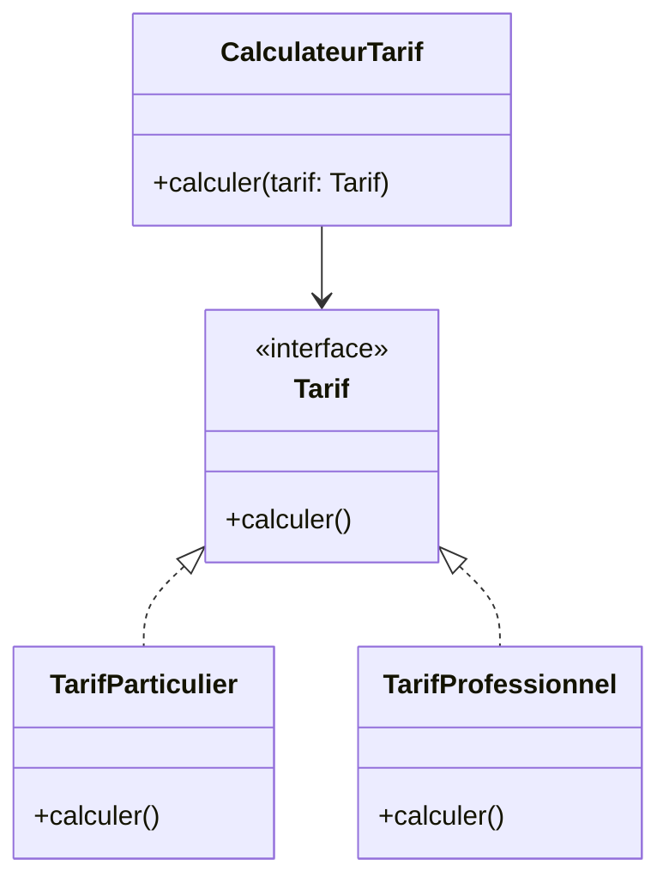

# Le Principe Ouvert/Fermé (OCP)

Le Principe Ouvert/Fermé (Open/Closed Principle, OCP) est un des fondements des principes SOLID. Il guide la conception d’un système où les entités logicielles peuvent être **étendues sans modifier leur code source existant**. Cette aptitude est cruciale pour préserver la stabilité du code tout en permettant son évolution.

---

## 1. Énoncé du principe OCP

Formulé par Bertrand Meyer, le principe dit :

> **"Les entités logicielles (classes, modules, fonctions, etc.) doivent être ouvertes à l’extension mais fermées à la modification."**

Concrètement, on doit pouvoir ajouter de nouvelles fonctionnalités en étendant le système, plutôt qu’en modifiant les classes existantes. Ceci évite de casser du code stable et facilite la maintenance.

---

## 2. Pourquoi appliquer l'OCP ?

- **Préserver la stabilité** : Modifier une classe existante risque d’introduire des bugs.
- **Favoriser l’évolutivité** : Ajouter de nouvelles fonctionnalités sans toucher au code éprouvé.
- **Encourager la réutilisabilité** : Les nouvelles fonctionnalités s’appuient sur les abstractions existantes.

---

## 3. Techniques pour respecter l’OCP

### Utiliser l’héritage ou le polymorphisme

Au lieu de modifier une classe, on crée une sous-classe qui étend son comportement.

### S’appuyer sur des interfaces et abstractions

Les clients utilisent des interfaces, ce qui permet d’ajouter des classes concrètes sans modifier le code client.

### Appliquer des patterns de conception

Des motifs classiques comme la stratégie (Strategy), le décorateur (Decorator) ou la fabrique (Factory) aident à isoler les extensions.

---

## 4. Exemple concret : calcul de tarif

Imaginons un système qui calcule un tarif selon une catégorie client.

### Violation du OCP

```python
class CalculateurTarif:
    def calculer(self, client):
        if client.type == "Particulier":
            return 100
        elif client.type == "Professionnel":
            return 200
```

Chaque fois qu'on ajoute un type client, il faut modifier la méthode `calculer` – ce qui viole le OCP.

---

### Respect du OCP

On définit une interface `Tarif` et des classes concrètes :

```python
from abc import ABC, abstractmethod

class Tarif(ABC):
    @abstractmethod
    def calculer(self):
        pass

class TarifParticulier(Tarif):
    def calculer(self):
        return 100

class TarifProfessionnel(Tarif):
    def calculer(self):
        return 200

class CalculateurTarif:
    def calculer(self, tarif: Tarif):
        return tarif.calculer()
```

Pour une nouvelle catégorie client, il suffit de créer une nouvelle classe `Tarif...` sans modifier `CalculateurTarif`.

---

## 5. Le pattern stratégique OCP



---

## 6. Autres bonnes pratiques

- **Favoriser la composition** plutôt que l’héritage pour plus de flexibilité.
- **Externaliser les règles métier** dans des modules indépendants.
- **Éviter les conditionnelles multiples dans les méthodes critiques**, en les remplaçant par des polymorphismes.

---

## Sources

- [Robert C. Martin - Open/Closed Principle](https://blog.cleancoder.com/uncle-bob/2014/05/08/SingleReponsibilityPrinciple.html#the-open-closed-principle)
- [Martin Fowler - Open Closed Principle](https://martinfowler.com/bliki/OpenClosedPrinciple.html)
- [StackOverflow - Open-Closed Principle Explanation](https://stackoverflow.com/questions/2663267/what-is-open-closed-principle)
- [Refactoring Guru - OCP tutorial and examples](https://refactoring.guru/design-patterns/open-closed-principle)

---

## Conclusion

Le Principe Ouvert/Fermé impose de **construire des entités logicielles qui s’adaptent aux évolutions sans modification interne**. En combinant interfaces, polymorphisme et composition, on conçoit des systèmes robustes où l’ajout de nouvelles fonctionnalités ne génère pas d'impact négatif sur le code existant. Appliquer l’OCP limite ainsi la dette technique et améliore la qualité du logiciel sur le long terme.