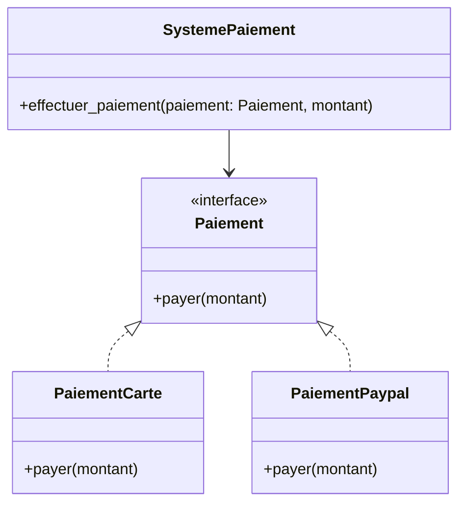

# Utilisation des abstractions pour respecter le Principe Ouvert/Fermé (OCP)

Le Principe Ouvert/Fermé (Open/Closed Principle, OCP) veut que les entités logicielles soient **ouvertes à l’extension mais fermées à la modification**. Un des leviers les plus puissants pour appliquer ce principe est l’usage d’**abstractions** — interfaces, classes abstraites ou contrats — qui isolent les comportements attendus sans fixer leur implémentation.

---

## 1. Pourquoi les abstractions facilitent l’OCP

- **Découpler les dépendances** : Le code dépend d’abstractions stables, pas d’implémentations qui peuvent changer.
- **Faciliter l’ajout de comportements** : Il suffit d’implémenter une nouvelle abstraction, pas de modifier le code existant.
- **Favoriser le polymorphisme** : Les clients utilisent l’abstraction, pouvant fonctionner avec différentes implémentations.
- **Réduire le risque d’induire des bugs** lors des évolutions.

---

## 2. Exemple typique : gestion de paiements

Imaginons un système qui gère différents modes de paiement.

### Mauvaise pratique (sans abstraction)

```python
class SystemePaiement:
    def effectuer_paiement(self, mode, montant):
        if mode == "carte":
            # code paiement par carte
            pass
        elif mode == "paypal":
            # code paiement via PayPal
            pass
```

Ajout d'un nouveau mode oblige à modifier `SystemePaiement`, violant l’OCP.

---

### Usage d’une abstraction (interface)

On définit une interface `Paiement` que chaque mode implémente :

```python
from abc import ABC, abstractmethod

class Paiement(ABC):
    @abstractmethod
    def payer(self, montant):
        pass

class PaiementCarte(Paiement):
    def payer(self, montant):
        print(f"Paiement de {montant} par carte")

class PaiementPaypal(Paiement):
    def payer(self, montant):
        print(f"Paiement de {montant} via PayPal")

class SystemePaiement:
    def effectuer_paiement(self, paiement: Paiement, montant):
        paiement.payer(montant)
```

---

## 3. Diagramme Mermaid illustrant ce découplage



---

## 4. Avantages concrets

- **Extensibilité** : Ajouter `PaiementBitcoin` sans modifier le reste du système.
- **Testabilité** : On peut mocker l’interface `Paiement` pour tester `SystemePaiement`.
- **Maintenance simplifiée** : Pas d’effet de bord sur les fonctions existantes en ajoutant de nouvelles fonctionnalités.

---

## 5. Bonnes pratiques associées

- **Définir clairement le contrat de l’abstraction**, ce qui facilite la cohérence entre implémentations.
- **Appliquer des designs patterns** comme stratégie (Strategy) qui repose sur abstractions.
- **Favoriser la composition plutôt que l’héritage rigide**, en reliant des comportements via abstractions.

---

## Sources

- [Martin Fowler - Open/Closed Principle](https://martinfowler.com/bliki/OpenClosedPrinciple.html)  
- [Robert C. Martin - SOLID Principles](https://blog.cleancoder.com/uncle-bob/2014/05/08/SingleReponsibilityPrinciple.html#the-open-closed-principle)  
- [Refactoring Guru - Open Closed Principle](https://refactoring.guru/design-patterns/open-closed-principle)  
- [Medium - How to use abstractions to follow OCP](https://medium.com/@danielwestheide/how-the-open-closed-principle-helps-you-write-better-code-e4e9865d9d7c)  

---

L’utilisation rigoureuse des abstractions est une approche clé pour appliquer le Principe Ouvert/Fermé. Elle garantit que vos systèmes peuvent s’adapter facilement sans compromettre leur stabilité, rendant le code plus propre, plus flexible et plus résistant aux régressions.