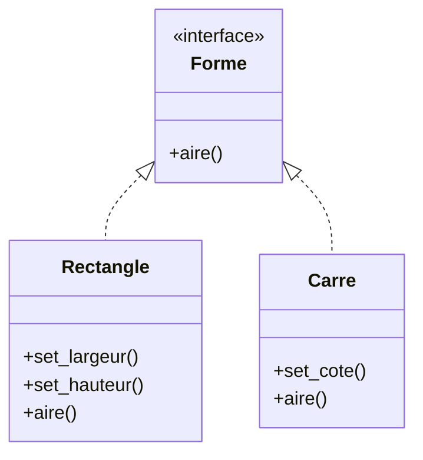

# Comprendre le Principe de Substitution de Liskov (LSP) : contrats et attentes des sous-types

Le Principe de Substitution de Liskov (Liskov Substitution Principle, LSP) est un fondement essentiel de la programmation orientée objet, complétant les principes SOLID. Proposé par Barbara Liskov en 1987, ce principe pose une règle simple mais puissante sur la relation entre classes parentes et sous-classes.

---

## 1. Formulation du LSP

Barbara Liskov définit le principe ainsi :

> « Si S est un sous-type de T, alors les objets de type T dans un programme peuvent être remplacés par des objets de type S sans modifier les propriétés désirables de ce programme (exactitude, tâches effectuées, etc.). »

Autrement dit, **les sous-classes doivent pouvoir remplacer les classes mères sans altérer le comportement attendu**.

---

## 2. Contrats et attentes dans les sous-types

### Le concept de contrat (Design by Contract)

Chaque classe définit un **contrat** : préconditions, postconditions, invariants, règles métier à respecter. Les sous-classes doivent **respecter** ce contrat pour garantir une substitution sans surprises.

- **Préconditions** : les conditions que l’appelant doit garantir avant d’appeler la méthode.
- **Postconditions** : les garanties après exécution de la méthode.
- **Invariants** : conditions qui doivent rester vraies durant toute la vie d’un objet.

### Conséquences pratiques

- Les sous-classes ne peuvent **pas renforcer** les préconditions (c’est-à-dire demander des conditions plus strictes).
- Les sous-classes doivent **maintenir ou affaiblir** les postconditions.
- Les invariants doivent être respectés par tous les types dans la hiérarchie.

---

## 3. Exemples concrets

### Exemple 1 : Violation du LSP

Considérons une classe `Rectangle` et sa sous-classe `Carré`.

```python
class Rectangle:
    def __init__(self, largeur, hauteur):
        self.largeur = largeur
        self.hauteur = hauteur

    def set_largeur(self, largeur):
        self.largeur = largeur

    def set_hauteur(self, hauteur):
        self.hauteur = hauteur

    def aire(self):
        return self.largeur * self.hauteur

class Carre(Rectangle):
    def set_largeur(self, largeur):
        self.largeur = largeur
        self.hauteur = largeur  # largeur = hauteur

    def set_hauteur(self, hauteur):
        self.hauteur = hauteur
        self.largeur = hauteur
```

**Problème** : Un `Carre` modifie les comportements de `set_largeur` et `set_hauteur` ce qui peut surprendre du code utilisant `Rectangle`. Par exemple :

```python
def modifier_rectangle(rect):
    rect.set_largeur(5)
    rect.set_hauteur(10)
    assert rect.aire() == 50   # Attendu rectangle : 5 * 10 = 50
```

Avec un `Carre`, cette assertion échoue car largeur et hauteur sont forcées à être égales.

---

### Exemple 2 : Respect du LSP avec interfaces claires

On peut repenser la hiérarchie en séparant carrément `Rectangle` et `Carre` en deux interfaces ou classes sans héritage.



Ainsi, il n’y a pas de contrat induisant des attentes contradictoires entre types.

---

## 4. Impact du non-respect du LSP

- Code fragile et imprévisible
- Difficultés à maintenir et à étendre
- Violation de la modularité et encapsulation

---

## 5. Résumé

| Aspect            | Exigence LSP                          |
|-------------------|-------------------------------------|
| Préconditions     | Ne pas être plus strictes            |
| Postconditions    | Maintenir ou affaiblir               |
| Exceptions        | Ne pas en ajouter de manière incompatible |
| Invariants        | Doivent être respectés par les sous-classes |

---

## Sources

- [Barbara Liskov - "Data Abstraction and Hierarchy"](https://web.stanford.edu/class/archive/cs/cs145/cs145.1128/readings/lsp.pdf)
- [Martin Fowler - Liskov Substitution Principle](https://martinfowler.com/bliki/LiskovSubstitutionPrinciple.html)
- [Robert C. Martin - Clean Architecture](https://8thlight.com/blog/uncle-bob/2012/08/13/the-clean-architecture.html)
- [Refactoring.Guru - Liskov Substitution Principle](https://refactoring.guru/design-patterns/liskov-substitution-principle)

---

Le Principe de Substitution de Liskov impose un respect strict des contrats définis par les classes parents. Son application garantit une hiérarchie de types cohérente et prévisible, condition essentielle à la robustesse et à la flexibilité des architectures orientées objet.