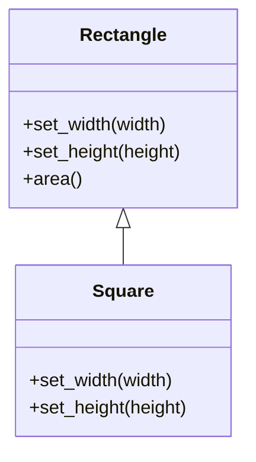

# Conséquences d’une violation du Principe de Substitution de Liskov (LSP)

Le Principe de Substitution de Liskov (LSP) garantit qu’une sous-classe peut remplacer sa superclasse sans changer le comportement attendu du programme. Lorsqu’il est violé, les effets se répercutent sur la **robustesse, la maintenabilité et la prévisibilité** du code, ce qui engendre plusieurs conséquences critiques.

---

## 1. Instabilité et comportements inattendus

Une violation du LSP introduit des comportements divergents chez les sous-classes, qui ne respectent pas les promesses (contrats) définies par la superclasse. En remplaçant une instance par une autre dans une hiérarchie de classes, on risque de casser les invariants ou d’obtenir des résultats incohérents.

### Exemple : Rectangle vs Carré

```python
class Rectangle:
    def __init__(self, width, height):
        self.width = width
        self.height = height
        
    def set_width(self, width):
        self.width = width
        
    def set_height(self, height):
        self.height = height
        
    def area(self):
        return self.width * self.height

class Square(Rectangle):
    def set_width(self, width):
        self.width = width
        self.height = width
        
    def set_height(self, height):
        self.height = height
        self.width = height
```

Ici, `Square` modifie les comportements hérités, ce qui peut introduire des erreurs dans du code qui attend une vraie instance de `Rectangle` :

```python
def print_area(rectangle):
    rectangle.set_width(5)
    rectangle.set_height(10)
    print(rectangle.area())

print_area(Rectangle(0, 0))  # affiche 50, attendu
print_area(Square(0, 0))     # affiche 100, résultat inattendu
```

---

## 2. Difficulté à maintenir et à étendre le code

Les violations du LSP entraînent souvent des tests complexes et des bugs subtils, car une méthode qui fonctionne avec la superclasse peut échouer lorsqu’une sous-classe est utilisée.

Les développeurs doivent ajouter des vérifications spécifiques ou utiliser des hacks pour contourner les comportements inattendus.

---

## 3. Perte de modularité

Le non-respect du LSP crée des dépendances fragiles entre classes qui devraient être substituables. Le polymorphisme, base de la modularité en orienté objet, est ainsi compromis.

Cela empêche d'utiliser des sous-classes dans des contextes génériques sans risque.

---

## 4. Illustration : hiérarchie incorrecte menant à une violation du LSP



Les méthodes `set_width` et `set_height` de `Square` rompent les attentes.

---

## 5. Résumé des conséquences d’une violation de LSP

| Conséquences                      | Description                                           |
|----------------------------------|-------------------------------------------------------|
| Comportements inattendus         | Résultats erronés ou incohérents à l’exécution       |
| Fragilité et bugs                | Difficultés à prévoir les effets des remplacements    |
| Complexité accrue                | Besoin de code conditionnel pour gérer les sous-types |
| Perte de modularité             | Suppression du polymorphisme efficace                 |
| Difficultés de maintenance      | Code plus dur à comprendre et à modifier              |

---

## 6. Comment éviter ces problèmes ?

- Respecter les contrats dans les sous-classes (préconditions, postconditions, invariants).
- Repenser la hiérarchie quand une sous-classe modifie trop le comportement.
- Utiliser la composition plutôt que l’héritage lorsque le LSP ne peut être respecté.

---

## Sources

- [Martin Fowler - Liskov Substitution Principle](https://martinfowler.com/bliki/LiskovSubstitutionPrinciple.html)  
- [Barbara Liskov - Data Abstraction and Hierarchy (1987)](https://web.stanford.edu/class/archive/cs/cs145/cs145.1128/readings/lsp.pdf)  
- [Refactoring.Guru - Liskov Substitution Principle](https://refactoring.guru/design-patterns/liskov-substitution-principle)  
- [Stack Overflow - What are the consequences of violating LSP?](https://stackoverflow.com/questions/46045862/what-happens-if-we-violate-the-liskov-substitution-principle)  

---

Le LSP soutient la **fiabilité** et la **souplesse** des hiérarchies de classes dans les systèmes orientés objet. Sa violation expose le projet à des erreurs difficiles à détecter, nuit à la réutilisabilité du code et complique la maintenance, ce qui rend son respect indispensable dans une architecture propre et robuste.