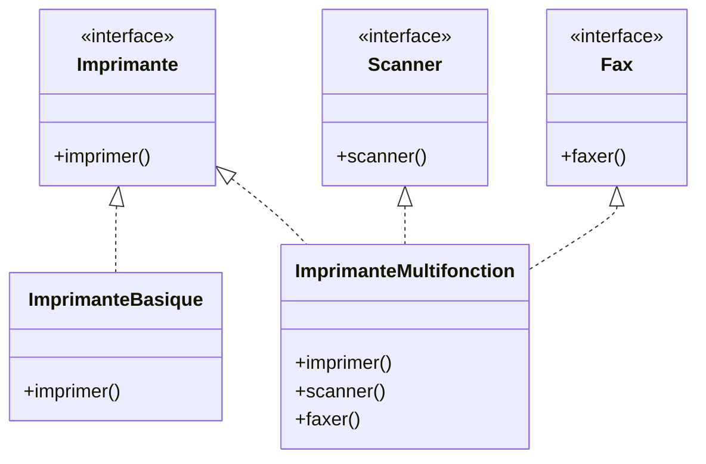

# Éviter les interfaces « grosses » (fat interfaces) avec le Principe de Ségrégation d'Interface (ISP)

Le Principe de Ségrégation d’Interface (Interface Segregation Principle, ISP), quatrième des principes SOLID, vise à concevoir des interfaces **spécifiques et cohérentes**, plutôt que des interfaces « grosses » regroupant trop de responsabilités disparates, souvent nommées *fat interfaces*.

---

## 1. Qu’est-ce qu’une interface « grosse » ?

Une *fat interface* contient plusieurs méthodes non liées fonctionnellement. Elle impose aux classes qui l’implémentent de fournir des implémentations pour toutes les méthodes, même celles inutiles ou incompatibles avec leur rôle, ce qui crée un couplage inutile et des implémentations inadaptées.

---

## 2. Conséquences des interfaces trop volumineuses

- **Implémentations inutiles** : Classes obligées d’implémenter des méthodes qu’elles n’utilisent pas, souvent avec des exceptions ou du code vide.
- **Couplage inutile** entre fonctionnalités non liées, rendant les systèmes rigides.
- **Difficultés de maintenance** et évolution plus compliquée.
- **Tests plus lourds** à mettre en place car les classes ont de nombreuses responsabilités mélangées.

---

## 3. Définition du Principe de Ségrégation d’Interface (ISP)

> **Les clients ne doivent pas être forcés de dépendre d’interfaces qu’ils n’utilisent pas.**

L’ISP encourage à découper les interfaces en plusieurs interfaces spécifiques, chacune couvrant un ensemble cohérent de fonctionnalités.

---

## 4. Exemples illustratifs

### Exemple d’interface « grosse »

```java
interface Imprimante {
    void imprimer(Document doc);
    void scanner(Document doc);
    void faxer(Document doc);
}
```

Si une classe `ImprimanteBasique` n’a que la fonctionnalité d’impression, elle est contrainte d’implémenter aussi `scanner` et `faxer`, ce qui est inutile.

### Refactoring en respectant l’ISP

```java
interface Imprimante {
    void imprimer(Document doc);
}

interface Scanner {
    void scanner(Document doc);
}

interface Fax {
    void faxer(Document doc);
}

class ImprimanteBasique implements Imprimante {
    public void imprimer(Document doc) {
        System.out.println("Impression Basique");
    }
}

// Une imprimante multifonction implémentera plusieurs interfaces
class ImprimanteMultifonction implements Imprimante, Scanner, Fax {
    public void imprimer(Document doc) { /* ... */ }
    public void scanner(Document doc) { /* ... */ }
    public void faxer(Document doc) { /* ... */ }
}
```

---

## 5. Diagramme : architecture des interfaces découplées



---

## 6. Avantages concrets de l’ISP

- **Flexibilité accrue** : Permet de composer des comportements en combinant plusieurs interfaces.
- **Clarté sémantique** : Chaque interface exprime clairement un rôle unique.
- **Réduction du couplage** : Les clients ne dépendent que des interfaces qu’ils utilisent.
- **Facilite le test unitaire** : Chaque interface cible une fonctionnalité spécifique à tester.

---

## 7. Conseils pour appliquer l’ISP

- Identifier les responsabilités distinctes.
- Diviser les interfaces suivant les comportements clients.
- Éviter les interfaces multi-responsabilités.
- Utiliser les interfaces pour séparer les préoccupations métier.

---

## Sources

- [Robert C. Martin - Clean Architecture, Interface Segregation Principle](https://blog.cleancoder.com/uncle-bob/2014/05/08/SingleReponsibilityPrinciple.html#interface-segregation-principle)  
- [Martin Fowler - Interface Segregation Principle](https://martinfowler.com/bliki/InterfaceSegregationPrinciple.html)  
- [Refactoring.Guru - Interface Segregation Principle](https://refactoring.guru/design-principles/interface-segregation)  
- [GeeksforGeeks - ISP in Software Engineering](https://www.geeksforgeeks.org/interface-segregation-principle-in-java-with-examples/)  

---

En évitant les *fat interfaces* grâce à l’ISP, on obtient des architectures plus modulaires, compréhensibles et évolutives, en s’assurant que chaque client n’a accès qu’aux fonctionnalités dont il a besoin.