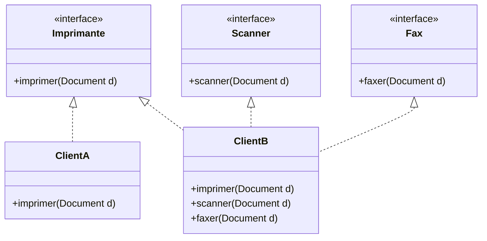

# Spécificité des interfaces pour les clients avec le Principe de Ségrégation d'Interface (ISP)

Le Principe de Ségrégation d’Interface (Interface Segregation Principle, ISP) indique que **les interfaces doivent être spécifiques aux besoins des clients** qui les utilisent. Autrement dit, chaque client ne devrait dépendre que des méthodes nécessaires à son fonctionnement.

---

## 1. Pour quoi « personnaliser » les interfaces selon les clients ?

Dans un système, différents clients peuvent avoir des besoins très variés. Imposer une interface générique, couvrant tous les cas d’usage, oblige les clients à gérer des méthodes inutiles, ce qui augmente la complexité et fragilise le système.

L’ISP préconise donc de **concevoir des interfaces adaptées** à chaque « famille » de clients, réduisant le couplage et simplifiant l’implémentation.

---

## 2. Exemple simple : services d'impression pour différents appareils

Considérons un service d'impression utilisé par deux types de clients :

- Client A : Imprime uniquement des documents simples
- Client B : Imprime, numérise et fax des documents

### Interface trop générique

```java
interface MachineMultifonction {
    void imprimer(Document d);
    void scanner(Document d);
    void faxer(Document d);
}
```

- Client A doit supporter `scanner` et `faxer` même s’il ne les utilise pas.
- Cela oblige à coder des méthodes inutilisées, souvent avec exceptions ou corps vides.

---

### Interfaces spécifiques pour chaque client

```java
interface Imprimante {
    void imprimer(Document d);
}

interface Scanner {
    void scanner(Document d);
}

interface Fax {
    void faxer(Document d);
}

class ImprimanteSimple implements Imprimante {
    @Override
    public void imprimer(Document d) {
        System.out.println("Impression simple");
    }
}

class MachineMultifonction implements Imprimante, Scanner, Fax {
    @Override public void imprimer(Document d) { /* ... */ }
    @Override public void scanner(Document d) { /* ... */ }
    @Override public void faxer(Document d) { /* ... */ }
}
```

---

## 3. Diagramme Mermaid : relation entre clients et interfaces spécifiques



Ici, Client A dépend uniquement de l’interface `Imprimante`, tandis que Client B dépend aussi de `Scanner` et `Fax`.

---

## 4. Avantages de la spécificité d’interface selon les clients

- **Moins de méthodes inutilisées** chez les implémentations.
- **Clarification des responsabilités** des clients et fournisseurs.
- **Allègement du code client** : pas de gestion des méthodes inutiles.
- **Meilleure évolutivité** : modification d’une interface n’affecte que les clients correspondants.

---

## 5. Conseils pour appliquer ce principe

- Analyser les besoins réels des différents clients.
- Ne pas créer une interface unique monolithique pour tous.
- Favoriser plusieurs interfaces fines représentant des fonctionnalités atomiques.
- Refactorer dès que l’on repère des méthodes non utilisées par certains clients.

---

## Sources

- [Interface Segregation Principle - Martin Fowler](https://martinfowler.com/bliki/InterfaceSegregationPrinciple.html)  
- [Robert C. Martin - Clean Code, Interface Segregation Principle](https://blog.cleancoder.com/uncle-bob/2014/05/08/SingleReponsibilityPrinciple.html#interface-segregation-principle)  
- [Refactoring.Guru - Interface Segregation Principle](https://refactoring.guru/design-principles/interface-segregation)  
- [GeeksforGeeks - ISP with examples](https://www.geeksforgeeks.org/interface-segregation-principle-in-java-with-examples/)  

---

Adapter les interfaces aux besoins spécifiques des clients maximise la clarté, réduit la complexité et facilite la maintenance du code, en évitant d’imposer aux clients des dépendances inutiles.