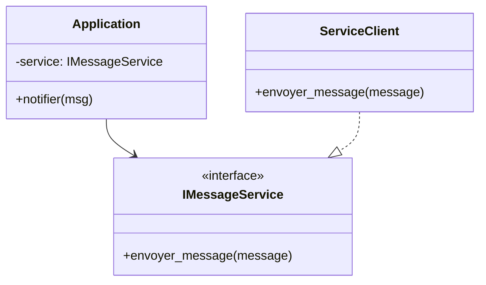

# Inverser les dépendances pour dépendre des abstractions plutôt que des concrétions : Principe d'Inversion de Dépendance (DIP)

Le Principe d'Inversion de Dépendance (Dependency Inversion Principle, DIP) est un des piliers des principes SOLID. Il prescrit une approche claire pour la gestion des dépendances dans le code orienté objet : **dépendre des abstractions (interfaces, classes abstraites), pas des classes concrètes**.

---

## 1. Le problème des dépendances classiques

Dans une architecture traditionnelle, un module de haut niveau (ex. une classe métier) dépend souvent directement de modules de bas niveau (ex. des implémentations concrètes de bases de données, services externes). Cela crée :

- Un **couplage fort** au sein du code.
- Une **rigidité dans l’évolution** et les tests.
- Une complexité accrue lors d’un remplacement ou d’une modification de l’implémentation.

---

## 2. Énoncé du DIP

Le DIP formalise 2 règles fondamentales :

- Les modules de haut niveau ne doivent pas dépendre des modules de bas niveau. Tous deux doivent dépendre d’abstractions.
- Les abstractions ne doivent pas dépendre des détails. Ce sont les détails qui doivent dépendre des abstractions.

L’enjeu est d’**inverser la direction naturelle des dépendances**, d’où le nom du principe.

---

## 3. Illustration par un exemple

### Sans DIP : dépendance vers une implémentation concrète

```python
class ServiceClient:
    def envoyer_message(self, message: str):
        print(f"Envoi du message: {message}")

class Application:
    def __init__(self):
        self.service = ServiceClient()

    def notifier(self, msg):
        self.service.envoyer_message(msg)
```

- `Application` crée directement une instance concrète `ServiceClient`.
- Elle est dépendante de cette implémentation.
- Changer le mode de notification nécessite de modifier `Application`.

---

### Avec DIP : dépendance sur une abstraction

```python
from abc import ABC, abstractmethod

class IMessageService(ABC):
    @abstractmethod
    def envoyer_message(self, message: str):
        pass

class ServiceClient(IMessageService):
    def envoyer_message(self, message: str):
        print(f"Envoi du message: {message}")

class Application:
    def __init__(self, service: IMessageService):
        self.service = service

    def notifier(self, msg):
        self.service.envoyer_message(msg)

# Utilisation
service = ServiceClient()
app = Application(service)
app.notifier("Hello DIP")
```

- `Application` dépend de l’interface abstraite `IMessageService`.
- Les détails d’implémentation sont injectés depuis l’extérieur (ex: injection de dépendances).
- Facilité d’échanger `ServiceClient` par une autre implémentation.

---

## 4. Diagramme Mermaid présentant l'architecture inversée



---

## 5. Avantages du DIP

- **Faible couplage** entre composants de haut et bas niveau.
- **Facilité de testabilité** : on peut injecter des mocks ou fakes.
- **Souplesse dans l’évolution** et la maintenance du système.
- **Respect des responsabilités** : chaque module fait ce qui lui revient, les abstractions définissent contractuellement les interactions.

---

## 6. Conseils pratiques

- Toujours programmer vers une interface, jamais vers une implémentation.
- Utiliser l’injection de dépendances pour fournir les implémentations concrètes.
- Définir clairement les interfaces comme contrats.
- Appliquer DIP conjointement avec d'autres principes SOLID (notamment OCP et ISP) pour obtenir un design robuste.

---

## Sources

- [Robert C. Martin - The Dependency Inversion Principle](https://blog.cleancoder.com/uncle-bob/2014/05/08/SingleReponsibilityPrinciple.html#dependency-inversion-principle)  
- [Martin Fowler - Inversion of Control Containers and the Dependency Injection pattern](https://martinfowler.com/articles/injection.html)  
- [Refactoring.Guru - Dependency Inversion Principle](https://refactoring.guru/design-principles/dependency-inversion)  
- [Microsoft Docs - Dependency Injection](https://learn.microsoft.com/en-us/dotnet/core/extensions/dependency-injection)  

---

Appliquer le DIP transforme la structure de votre code, permettant un découplage efficace grâce à l’utilisation d’abstractions.