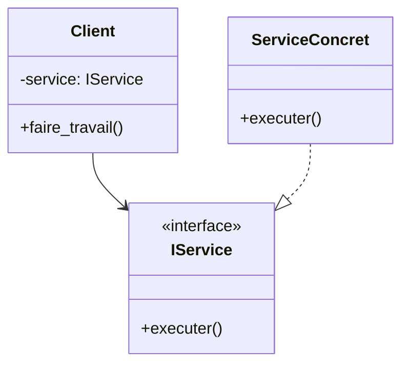

# Introduction au concept d'injection de dépendances

L’injection de dépendances (Dependency Injection, DI) est un mécanisme clé pour appliquer le Principe d’Inversion de Dépendance (DIP) dans les architectures logicielles. Elle consiste à **fournir les dépendances d’un objet depuis l’extérieur**, au lieu que l’objet les crée ou les localise lui-même.

---

## 1. Pourquoi utiliser l'injection de dépendances ?

Dans un système classique :

- Une classe crée et gère directement ses dépendances.
- Cela engendre un fort couplage entre classes concrètes.
- Limite la flexibilité, rend les tests unitaires complexes.

L’injection de dépendances permet d’**inverser la dépendance**, en déléguant la construction des dépendances à un composant externe (containeur DI, code d’assemblage).

---

## 2. Formes d’injection de dépendances

- **Injection par constructeur** : les dépendances sont passées via le constructeur.
- **Injection par setter** : dépendances fournies par des méthodes spécifiques.
- **Injection par interface** : le composant implémente une interface pour recevoir ses dépendances.

---

## 3. Exemple simple en Python : injection par constructeur

```python
from abc import ABC, abstractmethod

class IService(ABC):
    @abstractmethod
    def executer(self):
        pass

class ServiceConcret(IService):
    def executer(self):
        print("Service concret exécuté")

class Client:
    def __init__(self, service: IService):
        self.service = service

    def faire_travail(self):
        self.service.executer()

# Injection dépendance
service = ServiceConcret()
client = Client(service)
client.faire_travail()
```

- `Client` ne crée ni ne connaît la classe concrète `ServiceConcret`.
- `ServiceConcret` est injecté dans `Client`, ce qui respecte DIP.

---

## 4. Diagramme illustrant DI par constructeur



---

## 5. Avantages de l’injection de dépendances

- Découplage fort entre clients et implémentations.
- Facilité de substitution des dépendances (ex: mocks pour les tests).
- Centralisation et contrôle de la création des objets dépendants.
- Facilite le respect des autres principes SOLID.

---

## 6. DI dans les frameworks modernes

De nombreux frameworks et conteneurs DI existent dans divers langages :

- Spring (Java)
- .NET Core Dependency Injection
- Angular (TypeScript)
- Symfony (PHP)

Ils automatisent l’injection, la gestion du cycle de vie et la configuration des dépendances.

---

## 7. Sources

- [Martin Fowler - Inversion of Control Containers and the Dependency Injection pattern](https://martinfowler.com/articles/injection.html)  
- [Microsoft Docs - Dependency Injection in .NET](https://learn.microsoft.com/en-us/dotnet/core/extensions/dependency-injection)  
- [Refactoring.Guru - Dependency Injection](https://refactoring.guru/design-patterns/dependency-injection)  
- [Baeldung - Introduction to Dependency Injection in Java](https://www.baeldung.com/inversion-control-and-dependency-injection-in-spring)  

---

L’injection de dépendances est un levier puissant pour rendre le code modulaire, testable et maintenable, en assurant que les composants dépendent d’abstractions fournies au moment de l’exécution, et non de détails concrets inscrits dans leur code.