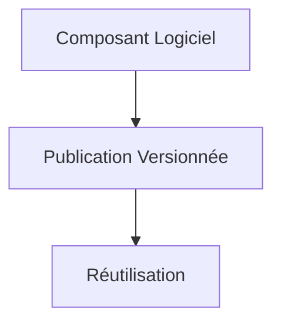

# REP (Release/Reuse Equivalence Principle) : Le principe d'équivalence de la réutilisation et de la publication

Le principe REP (Release/Reuse Equivalence Principle) est un concept fondamental dans la conception orientée composants défini par Robert C. Martin (Uncle Bob). Il établit un lien étroit entre la **réutilisation** d’un composant logiciel et sa **publication en tant qu’entité versionnée**.

---

## 1. Définition du principe REP

Le REP stipule que :

> Un composant réutilisable doit coïncider avec une unité de version ou de publication.

Autrement dit, **la granularité minimum d’un composant réutilisable est la même que celle d’une unité qui peut être publiée indépendamment** (librairie, module, package versionné).

Cela signifie que pour garantir une réutilisabilité réelle, un composant doit être **fabriqué, testé, maintenu et publié indépendamment**.

---

## 2. Pourquoi ce principe est-il important ?

- **Gestion efficace des dépendances** : publier un composant versionné facilite la gestion de ses dépendances dans d'autres projets.
- **Maintenance simplifiée** : les corrections ou évolutions sont encapsulées dans une version spécifique.
- **Réutilisation facilitée** : un composant packagé permet d'être intégré dans différents contextes aisément.
- **Cohérence des versions** : la traçabilité des versions assure une compatibilité et un contrôle précis.

---

## 3. Exemple concret : bibliothèque utilitaire

Imaginons une bibliothèque utilitaire regroupant des fonctions communes. Si ces fonctions sont simplement dispersées dans plusieurs projets sans version distincte, leur réutilisation devient difficile.

**Respect du REP :**

- La bibliothèque est empaquetée sous forme de composant (ex: package npm, jar Maven, PyPI).
- Chaque version du package est publiée et peut être importée en tant qu’entité autonome.
- Les projets qui dépendent de la bibliothèque déclarent leurs dépendances explicitement avec numéros de version.

---

## 4. Diagramme Mermaid illustrant une unité de réutilisation et publication

Le composant logiciel devient une **unité versionnée** (release) qui peut ensuite être réutilisée.

---

## 5. Conséquences d’une violation de REP

- Difficultés à partager ou intégrer des composants dans différents projets.
- Gestion de versions et des dépendances chaotique.
- Prolifération de copies non synchronisées du composant.
- Difficultés pour apporter des correctifs ciblés ou mise à jour indépendante.

---

## 6. Recommandations pour appliquer le REP

- Regrouper les classes/cohésions fonctionnelles dans des composants qui peuvent être publiés indépendamment.
- Utiliser des gestionnaires de paquets et systèmes de versions.
- Documenter clairement les versions et changements des composants.
- Automatiser la publication et l’intégration continue pour simplifier la diffusion des versions.

---

## Sources

- Robert C. Martin, *Agile Software Development, Principles, Patterns, and Practices* (2002)  
- [Clean Architecture - Robert C. Martin](https://blog.cleancoder.com/uncle-bob/2012/08/13/the-component-principles.html)  
- [Versioning and Releases - Martin Fowler](https://martinfowler.com/articles/versioning.html)  
- [NDepend Documentation - Component Principles](https://www.ndepend.com/docs/component-principles)  

---

Respecter le REP facilite la création de composants robustes, cohérents et véritablement réutilisables grâce à la mise en place d’une organisation claire des versions et des publications. Ce principe est un fondement pour gérer efficacement la modularité et la distribution dans les architectures logicielles modernes.