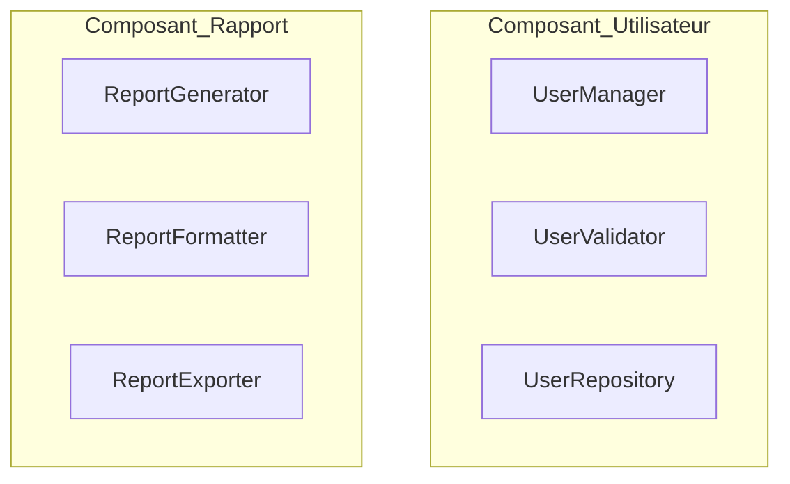

# CCP (Common Closure Principle) : Le principe de clôture commune

Le CCP (Common Closure Principle), formulé par Robert C. Martin, est un des principes fondamentaux de la cohésion des composants logiciels. Il vise à organiser les composants selon leur sensibilité aux mêmes raisons de changement, assurant ainsi une plus grande robustesse et maintenabilité.

---

## 1. Définition du CCP

> **Les classes qui changent pour les mêmes raisons doivent être regroupées au sein d’un même composant.**

Le principe indique que dès qu’un ensemble de classes est sujet à évoluer pour une cause commune, elles doivent être combinées dans un même composant pour que le système soit plus modulaire et le processus de maintenance simplifié.

---

## 2. Pourquoi appliquer le CCP ?

- Éviter que la modification d’une fonctionnalité nécessite des changements dans plusieurs composants distincts.
- Faciliter **l’isolation des modifications** et limiter leur impact.
- Favoriser une meilleure cohérence dans les regroupements fonctionnels.
- Réduire le risque de rupture dans des parties indépendantes du système.

---

## 3. Illustration par un exemple

### Mauvaise organisation

Imaginons un projet avec trois classes liées à la gestion des utilisateurs et trois autres pour les rapports :

- `UserManager`
- `UserValidator`
- `UserRepository`
- `ReportGenerator`
- `ReportFormatter`
- `ReportExporter`

Si `UserManager` et `ReportGenerator` sont regroupés dans le même composant, toute modification touchant la gestion des utilisateurs entraînera une recompilation ou un déploiement du composant contenant aussi la génération des rapports, ce qui est inefficace.

### Organisation respectant le CCP

Regrouper les classes selon leurs raisons communes de changements :

- Composant Utilisateur : `UserManager`, `UserValidator`, `UserRepository`
- Composant Rapport : `ReportGenerator`, `ReportFormatter`, `ReportExporter`

Ainsi, si la gestion des utilisateurs change, seules les classes dans le composant Utilisateur seront modifiées ou déployées, sans affecter la partie rapports.

---

## 4. Diagramme Mermaid illustrant le regroupement selon le CCP

---

## 5. Conséquences d’une violation du CCP

- Changements fréquents entraînant la nécessité de modifier plusieurs composants.
- Augmentation du couplage entre composants.
- Déploiements et tests plus lourds et risqués.
- Diminution de la capacité à isoler les effets des modifications.

---

## 6. Conseils pour appliquer le CCP

- Identifier les raisons potentielles de changement dès la conception.
- Regrouper les classes selon ces raisons.
- Suivre les évolutions du système pour réorganiser les composants en fonction des nouvelles causes de changement.
- Coupler le CCP avec d’autres principes comme le CRP (Common Reuse Principle) pour optimiser la modularité.

---

## Sources

- Robert C. Martin, *Agile Software Development, Principles, Patterns, and Practices* (2002)  
- [Clean Architecture - Robert C. Martin, Composant Principles](https://blog.cleancoder.com/uncle-bob/2012/08/13/the-component-principles.html)  
- [NDepend Documentation - Component Principles](https://www.ndepend.com/docs/component-principles)  
- [Refactoring.Guru - Component principles overview](https://refactoring.guru/design-principles/component-principles)  

---

Le CCP offre une méthodologie claire pour structurer les composants en fonction des raisons de changement, maximisant ainsi la maintenabilité et la robustesse des architectures logicielles. Respecter ce principe limite l'impact des évolutions et simplifie la gestion des dépendances entre modules.