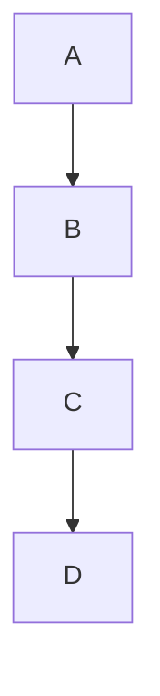

# ADP (Acyclic Dependencies Principle) : Le principe des dépendances acycliques

Le principe ADP (Acyclic Dependencies Principle) est un élément essentiel pour garantir la qualité architecturale des systèmes modulaires. Il impose que le graphe de dépendances entre composants logiciels soit **sans cycles**, assurant ainsi une structure claire, maintenable et évolutive.

---

## 1. Définition du principe ADP

> Les dépendances entre les composants doivent former un graphe acyclique, c’est-à-dire sans cycles.

Cela signifie que **nul composant ne doit dépendre, directement ou indirectement, d’un autre composant qui dépend de lui**. Éviter les cycles permet d’assurer une hiérarchie claire dans l’architecture.

---

## 2. Pourquoi les cycles de dépendances posent problème ?

Les cycles introduisent plusieurs difficultés :

- **Complexité accrue** : compréhension difficile des relations entre composants.
- **Blocage de l’évolution** : modification d’un composant en cascade pour gérer les cycles.
- **Problèmes de compilation et de déploiement** : interdépendances empêchant une compilation ou un déploiement modulaires.
- **Tests compliqués** : impossibilité d’isoler proprement les composants pour les tester.

---

## 3. Exemple illustratif de dépendances cycliques

Supposons trois composants : 

- `A` dépend de `B`
- `B` dépend de `C`
- `C` dépend de `A`

Ce cycle `A → B → C → A` crée une boucle qui empêche de modifier l’un sans affecter les autres.

---

### Résolution en cassant le cycle

On peut refactorer en introduisant une abstraction ou en modifiant la direction de certaines dépendances :

- `A` dépend de `B`
- `B` dépend d’une interface `IC` abstraite
- `C` implémente `IC`
- `C` ne dépend plus d’`A`

---

## 4. Diagramme Mermaid représentant un graphe de dépendances acyclique

Ici, la chaîne de dépendances va de `A` vers `D` sans retour : pas de cycle.

---

## 5. Comment appliquer l’ADP ?

- **Analyser les dépendances** à la phase de conception et régulièrement pendant le développement.
- **Introduire des abstractions** (interfaces, classes abstraites) pour casser les cycles.
- **Utiliser l’injection de dépendances** pour inverser certaines relations.
- **Repenser la structure des composants** pour assurer une hiérarchie claire.
- **Automatiser la détection des cycles** avec des outils d’analyse statique.

---

## 6. Outils pour détecter et gérer les dépendances cycliques

- **SonarQube** : détecte les cycles dans le code.
- **NDepend** (pour .NET) : analyse les dépendances entre composants.
- **Structure101**, **Lattix** : permettent de visualiser et contrôler les graphes de dépendances.

---

## 7. Sources

- Robert C. Martin, *Agile Software Development, Principles, Patterns, and Practices* (2002)  
- [Clean Architecture - Uncle Bob](https://blog.cleancoder.com/uncle-bob/2012/08/13/the-component-principles.html)  
- [Martin Fowler - Dependency Cycles](https://martinfowler.com/bliki/DependencyCycle.html)  
- [NDepend - Managing Dependency Cycles](https://www.ndepend.com/docs/architecture-dependency-cycles)  

---

En appliquant le principe ADP, vous garantissez que l’architecture de votre système reste gérable, évolutive et moins sujette aux effets indésirables des dépendances circulaires. C’est un levier puissant pour rationaliser la conception et simplifier le cycle de vie logiciel.