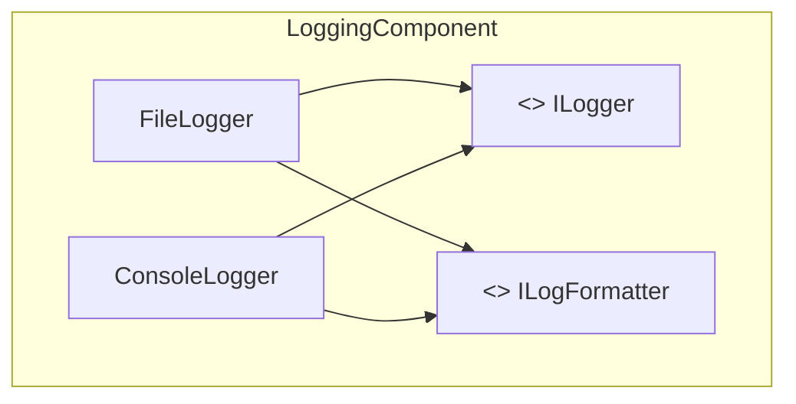

# SAP (Stable Abstractions Principle) : Le principe des abstractions stables

Le SAP (Stable Abstractions Principle) est un principe clé de conception des composants logiciels, formulé par Robert C. Martin. Il complète les principes de stabilité en introduisant la notion d’abstraction comme critère de flexibilité pour les composants jugés stables.

---

## 1. Définition du SAP

> Un composant stable doit être **abstrait**, c’est-à-dire fournir des interfaces, des classes abstraites ou des mécanismes d’extension qui permettent son évolution sans modifier le composant lui-même.

Autrement dit, plus un composant est stable (peu modifié et beaucoup dépendu), plus il doit être basé sur des **abstractions** pour permettre la flexibilité du système sans compromettre la stabilité.

---

## 2. Pourquoi ce principe est-il important ?

- Les composants **stables** sont difficilement modifiables sans casser les dépendants.
- Le SAP garantit que ces composants stables ne sont pas rigides mais **extensibles** par dérivation ou implémentation.
- Ainsi, la modification d’un comportement spécifique peut être réalisée par extension/implémentation des abstractions plutôt que modification du composant stable lui-même.
  
Cela améliore la maintenabilité et la souplesse du système.

---

## 3. Mesure de l’abstraction

Robert C. Martin propose une métrique reliant abstractions et stabilité :

\[
A = \frac{N_a}{N_c}
\]

- \(N_a\) : nombre de classes abstraites dans le composant.
- \(N_c\) : nombre total des classes dans le composant.

L’**indice d’abstraction** \(A\) varie de 0 (pas d’abstraction) à 1 (toutes les classes sont abstraites).

---

## 4. Zone d’équilibre (zone de maturité)

L’idée clé est d’équilibrer la stabilité \(I\) et l’abstraction \(A\).  
Soit :

- \(I\) : indice de stabilité (\(0\) stable, \(1\) instable)
- \(A\) : indice d’abstraction (\(0\) concrète, \(1\) abstraite)

La zone idéale se situe autour de :

\[
D = |A + I - 1|
\]

où \(D\) quantifie la "distance" à l’équilibre.

- Si \(D\) est proche de 0, le composant est bien conçu.
- Si un composant est très stable (\(I \approx 0\)) mais peu abstrait (\(A \approx 0\)), il est **immobile** et rigide.
- Si un composant est instable (\(I \approx 1\)) mais très abstrait (\(A \approx 1\)), il est inutilement complexe.

---

## 5. Exemple concret

Considérons un composant `Logging` qui est stable (beaucoup dépendant), il doit fournir :

- Interfaces `ILogger`, `ILogFormatter` abstraites,
- Implémentations concrètes dans des sous-classes.

Ainsi, les clients peuvent étendre ou changer le comportement en implémentant ces interfaces sans modifier le composant stable.

---

## 6. Diagramme Mermaid illustrant SAP

Le composant est stable mais basé sur des abstractions pour permettre des extensions.

---

## 7. Conseils pour appliquer le SAP

- Encouragez l’usage systématique d’interfaces ou classes abstraites dans les composants stables.
- Vérifiez la cohérence entre stabilité et abstraction dans votre architecture.
- Favorisez les designs ouverts à l’extension mais fermés à la modification (principe OCP).
- Analysez régulièrement l’architecture avec des outils pour mesurer \(I\) et \(A\).

---

## 8. Sources

- Robert C. Martin, *Agile Software Development, Principles, Patterns, and Practices* (2002)  
- [Clean Architecture - Uncle Bob](https://blog.cleancoder.com/uncle-bob/2012/08/13/the-component-principles.html)  
- [NDepend - Stable Abstractions Principle](https://www.ndepend.com/docs/component-stability-metrics)  
- [Martin Fowler - Component Principles](https://martinfowler.com/articles/components.html)  

---

Le SAP favorise une architecture flexible en insistant sur l’intégration d’abstractions dans les composants stables, facilitant l’évolution et minimisant le risque de cassure. Intégrer ce principe conduit à des systèmes à la fois robustes et faciles à faire évoluer.