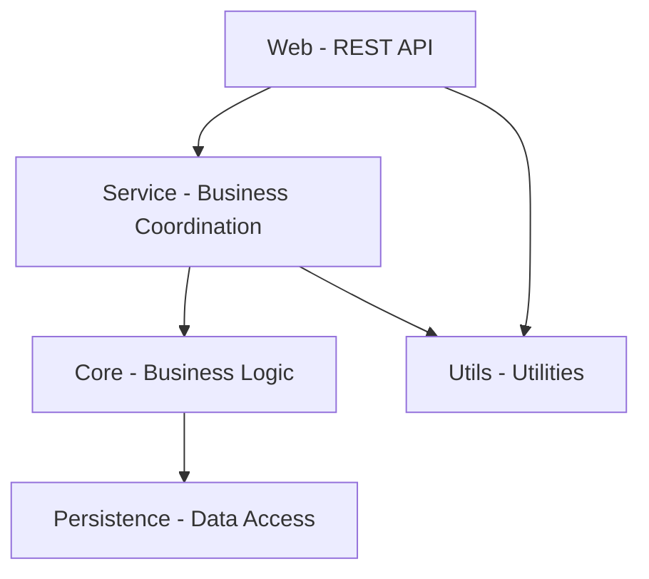

# Comment organiser les composants : packages, modules et assemblies

Organiser efficacement les composants dans un projet logiciel est un levier majeur pour obtenir des systèmes modulaires, maintenables et évolutifs. Cette organisation repose sur la structuration en unités logiques telles que packages, modules ou assemblies, qui regroupent des classes et services selon leurs responsabilités et leurs dépendances.

---

## 1. Définitions clés

**Packages** : regroupements logiques de classes souvent utilisés dans les langages orientés objet (Java, Python…). Ils permettent de structurer le code source en arborescences reflétant la modularité fonctionnelle.

**Modules** : unités de compilation ou de déploiement. Un module incorpore généralement un ensemble cohérent de packages avec des interfaces bien définies. Par exemple, dans Java 9+, un module est une entité explicitement déclarée.

**Assemblies** : terme fréquent dans l’écosystème .NET, désigne une unité de déploiement contenant du code compilé, des métadonnées et des ressources. Une assembly peut contenir plusieurs modules.

---

## 2. Principes pour une bonne organisation

1. **Cohérence fonctionnelle** : regrouper dans un même composant les éléments liés par une responsabilité ou fonctionnalité commune (principe de cohésion).  
2. **Gestion des dépendances** : minimiser les dépendances entre composants, en suivant les principes d'architecture (ADP, SDP).  
3. **Encapsulation** : exposer uniquement les interfaces nécessaires; masquer les détails internes.  
4. **Réutilisabilité** : favoriser la réutilisation de composants indépendants.  
5. **Taille raisonnable** : éviter que les composants deviennent trop volumineux ou trop fractionnés.

---

## 3. Exemple d’organisation dans un projet Java

Imaginons une application de gestion de commandes divisée en plusieurs modules logiques :

- **core** : logique métier centrale, entités, règles.  
- **persistence** : accès aux données (DAO, repositories).  
- **service** : coordination des opérations métier, transactions.  
- **web** : interfaces utilisateur REST, API.  
- **util** : classes utilitaires partagées.

Chaque module est indépendant et ne dépend que des modules strictement nécessaires.

---

### Diagramme Mermaid simplifié

---

## 4. Modules et Assemblies : différences dans les environnements

- **Java modules** (depuis JDK 9) : définis dans `module-info.java`, explicites quant aux exports et aux dépendances.  
- **.NET assemblies** : contiennent des métadonnées, types, ressources, peuvent être signées pour support de versionnement.

L’important est la définition claire des dépendances et des interfaces pour faciliter le développement en parallèle, la maintenance et la montée en charge.

---

## 5. Stratégies de séparation courantes

- **Par fonctionnalité** : regrouper tous les artefacts nécessaires à une fonctionnalité spécifique (ex : module Commandes).  
- **Par couche** : séparer présentation, logique métier, accès données en différents composants.  
- **Par domaine métier (DDD)** : découper selon les contextes liés du domaine, ce qui favorise la cohérence et l’indépendance des contextes.

---

## 6. Conseils pratiques

- Documentez les dépendances entre modules avec des graphes.  
- Automatisez la vérification des règles via des outils d’analyse statique (NDepend, SonarQube, ArchUnit).  
- Adoptez des conventions claires sur la structuration des répertoires et noms des packages/modules.  
- Favorisez les interfaces et abstractions pour découpler fortement les composants.

---

## 7. Sources et références

- *Clean Architecture* - Robert C. Martin (2017)  
- [Project Jigsaw - Modular System in Java 9+](https://openjdk.org/projects/jigsaw/)  
- [Microsoft Docs - Assemblies and the Global Assembly Cache](https://docs.microsoft.com/en-us/dotnet/framework/app-domains/assemblies-and-the-global-assembly-cache)  
- [Martin Fowler - Modularization](https://martinfowler.com/articles/modularization.html)  
- [ArchUnit - Java Architecture Testing Library](https://www.archunit.org/)  

---

Organiser ses composants en packages, modules ou assemblies de manière claire et disciplinée permet d’assurer une architecture logique solide. Cela facilite la compréhension, la maintenance, la réutilisation et l’évolution des systèmes logiciels complexes.