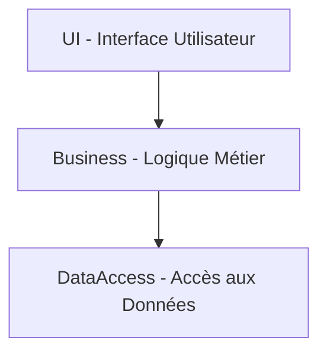

# Gérer les dépendances entre les composants

Dans une architecture logicielle modulaire, la gestion des dépendances entre composants est un facteur déterminant de la maintenabilité, de la flexibilité et de la qualité globale du système. Un contrôle rigoureux des dépendances permet d’éviter le couplage excessif, les cycles et de faciliter l’évolution.

---

## 1. Pourquoi gérer les dépendances ?

- **Réduire le couplage** : pour limiter l’impact des changements dans un composant sur les autres.  
- **Favoriser la réutilisation** : un composant faiblement dépendant est plus facilement réutilisable.  
- **Simplifier les tests** : isoler les composants facilite les tests unitaires et l’intégration.  
- **Optimiser le déploiement** : des dépendances explicites et contrôlées permettent un déploiement modulaire.  

---

## 2. Principes pour une gestion efficace

### 2.1 Principe des dépendances acycliques (ADP)

Le graphe des dépendances entre composants ne doit pas contenir de cycles.  
Un cycle crée des interdépendances fortes, augmentant la complexité et freinant la maintenance.

### 2.2 Principe des dépendances stables (SDP)

Les composants doivent dépendre uniquement de composants **plus stables** (moins susceptibles de changer).  
Ainsi, la stabilité construit une hiérarchie naturelle dans les dépendances.

### 2.3 Principe des abstractions stables (SAP)

Les composants stables doivent être abstraits (interfaces, classes abstraites) pour garantir leur extensibilité sans modification directe.

---

## 3. Techniques pour maîtriser les dépendances

- **Utilisation d’interfaces / abstractions** : écrivez les dépendances sur des interfaces plutôt que sur des implémentations concrètes.  
- **Injection de dépendances** : déléguez la fourniture des dépendances à un conteneur ou framework, ce qui favorise l’inversion des dépendances.  
- **Modularisation stricte** : déclarez explicitement dans les modules/packages les dépendances autorisées (ex : `module-info.java` en Java 9+).  
- **Audit et analyse de dépendances** : automatiquement vérifier la présence de cycles et violations avec des outils (NDepend, SonarQube, ArchUnit).

---

## 4. Exemple concret

Considérons le projet d’une application web où trois composants sont identifiés:

- `UI` (interface utilisateur),  
- `Business` (logique métier),  
- `DataAccess` (accès aux données).

Une bonne organisation des dépendances serait :

- `UI` dépend de `Business` (pour appeler la logique métier).  
- `Business` dépend de `DataAccess` (pour lire/écrire les données).  
- `DataAccess` **ne dépend de personne**.  

Ce schéma respecte ADP : pas de cycle, et SDP : le composant `DataAccess` est stable, « en bas » de la hiérarchie.

---

### Diagramme Mermaid illustrant cet exemple

---

## 5. Gestion des dépendances dans le cycle de vie

- **Au développement** : appliquer les principes et techniques pour éviter d’introduire des dépendances inappropriées.  
- **Au build** : utiliser des outils d’analyse pour valider les règles d’architecture.  
- **Au déploiement** : packager les composants de façon cohérente pour respecter les dépendances.

---

## 6. Outils recommandés

- **NDepend (pour .NET)** : analyse avancée des dépendances avec visualisations.  
- **SonarQube** : contrôle de la qualité et détection des cycles de dépendances.  
- **ArchUnit (pour Java)** : tests automatisés des règles d’architecture.  
- **Deptrac (PHP)** : contrôle de la couche d’abstraction et des dépendances.

---

## 7. Sources

- Robert C. Martin, *Agile Software Development, Principles, Patterns, and Practices* (2002)  
- [Uncle Bob - The Component Principles](https://blog.cleancoder.com/uncle-bob/2012/08/13/the-component-principles.html)  
- [Martin Fowler - DependencyOverhead](https://martinfowler.com/articles/components.html)  
- [NDepend Documentation - Dependency Analysis](https://www.ndepend.com/docs/architecture-dependency)  
- [SonarQube - Dependency Cycles](https://docs.sonarqube.org/latest/analysis/dependency-graph/)  

---

Une gestion disciplinée des dépendances entre composants assure une architecture logique ordonnée, favorisant la stabilité du système et sa capacité à évoluer sous pression des changements. Intégrer ces bonnes pratiques dès la conception est le pilier d’un logiciel robuste.