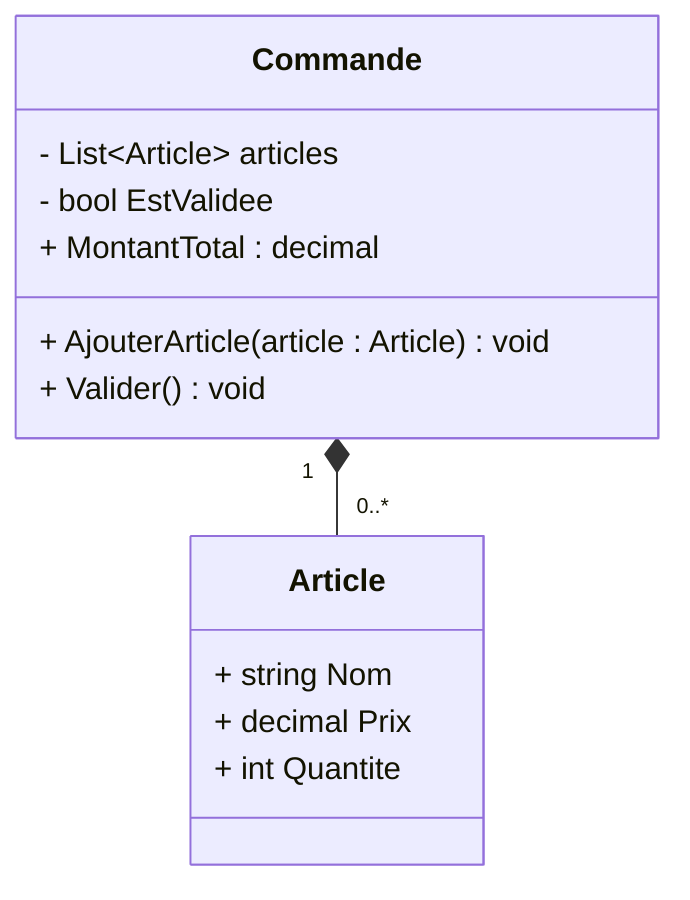

# Règles métier d'entreprise (Enterprise Business Rules) dans les Entités

Dans la Clean Architecture, les entités (Entities) sont au cœur du système. Elles incarnent les règles métier d'entreprise, celles qui définissent le fonctionnement et la logique fondamentale indépendamment des technologies ou frameworks utilisés. Comprendre et appliquer ces règles permet d’obtenir une architecture à la fois flexible, maintenable et pérenne.

---

## 1. Qu’est-ce qu’une règle métier d’entreprise ?

Une règle métier d’entreprise est une contrainte ou une logique qui reflète les besoins, objectifs et politiques propres à une organisation. Elle s’applique directement aux entités du domaine métier, définissant :

- Ce qui est permis ou interdit.  
- Les transformations valides d’état.  
- Les calculs et décisions basées sur les données métiers.

Ces règles doivent être indépendantes des détails techniques (base de données, interface utilisateur) pour permettre la réutilisation et la longévité du code métier.

---

## 2. Rôle des Entités dans la Clean Architecture

- **Centralisation** : Les entités regroupent les règles métier sous forme de propriétés et méthodes.  
- **Indépendance** : Elles ne dépendent d’aucune technologie extérieure (ex. frameworks, UI, base de données).  
- **Réutilisabilité** : Peuvent être utilisées dans différents contextes (web, mobile, batch…).  
- **Protection** : Encapsulent la logique métier, protégeant ainsi les règles des modifications non intentionnelles.

---

## 3. Exemple simple de règles métier dans une entité `Commande`

Supposons une entité `Commande` :

- Une commande ne peut pas être validée si elle ne contient pas au moins un article.  
- Le montant total doit être recalculé automatiquement lorsque des articles sont ajoutés ou supprimés.  
- Une commande validée ne peut plus être modifiée.

```csharp
public class Commande
{
    private List<Article> articles = new List<Article>();
    public bool EstValidee { get; private set; } = false;

    public IReadOnlyList<Article> Articles => articles.AsReadOnly();

    public decimal MontantTotal => articles.Sum(a => a.Prix * a.Quantite);

    public void AjouterArticle(Article article)
    {
        if (EstValidee)
            throw new InvalidOperationException("Commande déjà validée, modification impossible.");

        articles.Add(article);
    }

    public void Valider()
    {
        if (!articles.Any())
            throw new InvalidOperationException("Commande vide, ne peut être validée.");

        EstValidee = true;
    }
}
```

---

## 4. Diagramme Mermaid illustrant la structure d’une entité



Ce diagramme montre une relation d’agrégation entre `Commande` et `Article` et les méthodes contrôlant les règles métier.

---

## 5. Bonnes pratiques pour coder les règles métier

- **Encapsulation stricte** des propriétés et validation dans les méthodes métier.  
- **Pas de dépendance externe** (pas de framework, logging, accès données).  
- **Tests unitaires exhaustifs** sur les règles métier pour garantir leur bon fonctionnement.  
- **Utilisation de modèles riches** plutôt que simples structures de données (anémique).

---

## 6. Sources et références

- Robert C. Martin, *Clean Architecture*, 2017  
- Vaughn Vernon, *Implementing Domain-Driven Design*, 2013  
- Eric Evans, *Domain-Driven Design: Tackling Complexity*, 2003  
- [Microsoft Docs - Enterprise business rules](https://docs.microsoft.com/en-us/azure/architecture/guide/architecture-styles/domain-driven-design#enterprise-business-rules)  
- [Clean Architecture patterns and principles](https://8thlight.com/blog/uncle-bob/2012/08/13/the-clean-architecture.html)  

---

Les règles métier d’entreprise incarnées dans les entités sont le socle stable et indépendant d'une application. En les isolant et en les encapsulant dans des entités, la Clean Architecture garantit que ces règles restent compréhensibles, testables et peu affectées par les mutations technologiques autour.