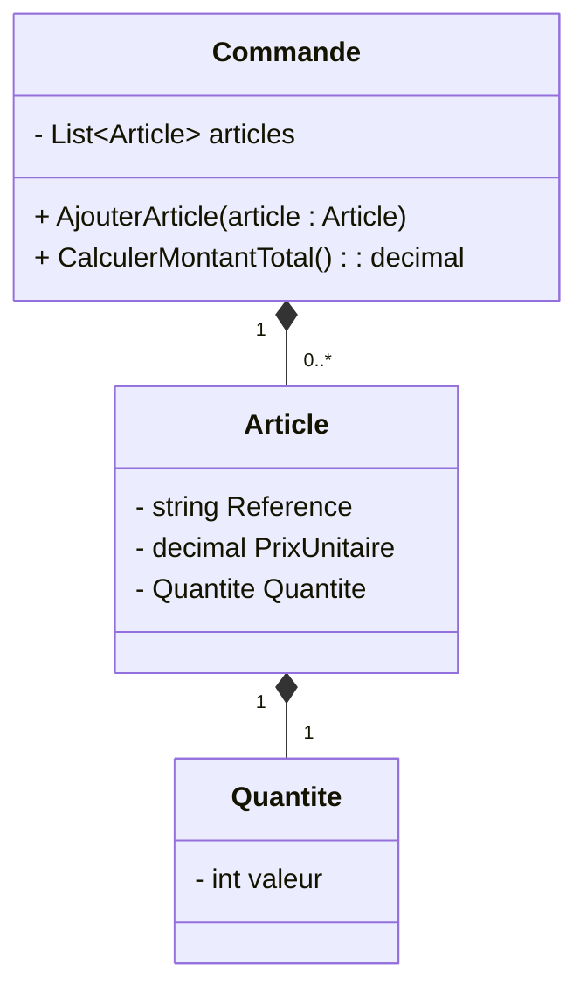

# Structures de données essentielles dans les Entités de la Clean Architecture

Les entités (Entities) constituent le noyau de la Clean Architecture en encapsulant les règles métier d'entreprise. Leur conception intègre souvent des **structures de données essentielles** qui assurent la représentation cohérente et efficace du domaine métier. Choisir les bonnes structures de données est primordial pour modéliser fidèlement le comportement métier tout en facilitant les opérations courantes.

---

## 1. Rôle des structures de données dans les entités

Dans une entité, les structures de données servent à :

- Représenter les propriétés et relations d’un objet métier (ex. liste d’articles dans une commande).  
- Encapsuler l’état interne pour préserver les invariants métier (ex. stock minimal).  
- Optimiser l’accès et la manipulation des données métier.  
- Favoriser la clarté et la robustesse du modèle métier.

---

## 2. Structures courantes utilisées en entités

### 2.1 Types primitifs et objets Valeurs (Value Objects)

- **Types primitifs** (int, string, bool, decimal) définissant les données scalaires.  
- **Value Objects** encapsulant un concept métier (ex. une `Adresse`, `Quantite`) avec validation et égalité basée sur la valeur.  
Ils garantissent la cohérence des données et permettent une modélisation expressive.

### 2.2 Collections

- **Listes** (`List<T>`, `Array`...) : pour regrouper des éléments ordonnés ou non ordonnés (ex. articles d’une commande).  
- **Sets** : pour garantir l’unicité des éléments.  
- **Dictionnaires (maps)** : pour accéder rapidement aux éléments par clé (ex. produits indexés par leur référence).  
- Choix de la collection en fonction du besoin métier (ordre, unicité, performance).

### 2.3 Objets agrégats (Aggregates)

- Structures composées d'une entité racine et d’objets liés, gérant la cohérence transactionnelle.

---

## 3. Exemple : structuration d’une entité `Commande`

```csharp
// Value Object représentant une quantité validée
public struct Quantite
{
    private readonly int valeur;
    public Quantite(int valeur)
    {
        if (valeur <= 0) throw new ArgumentException("La quantité doit être supérieure à zéro.");
        this.valeur = valeur;
    }
    public int Valeur => valeur;
}

// Entité Article avec un Value Object Quantite
public class Article
{
    public string Reference { get; }
    public decimal PrixUnitaire { get; }
    public Quantite Quantite { get; private set; }

    public Article(string reference, decimal prixUnitaire, Quantite quantite)
    {
        Reference = reference;
        PrixUnitaire = prixUnitaire;
        Quantite = quantite;
    }
}
  
// Entité Commande avec une liste d’articles
public class Commande
{
    private readonly List<Article> articles = new List<Article>();
    public IReadOnlyList<Article> Articles => articles.AsReadOnly();

    public void AjouterArticle(Article article)
    {
        articles.Add(article);
    }

    public decimal CalculerMontantTotal()
    {
        return articles.Sum(a => a.PrixUnitaire * a.Quantite.Valeur);
    }
}
```

---

## 4. Diagramme Mermaid illustrant la composition



---

## 5. Bonnes pratiques

- **Encapsuler les données critiques dans des Value Objects** avec validation et règles métier.  
- **Limiter l’accès direct aux collections** via des méthodes d’ajout/suppression, évitant ainsi la modification arbitraire de la structure interne.  
- **Choisir la collection adaptée** (ex. `HashSet` pour l’unicité, `List` pour l’ordre).  
- **Respecter le principe d’immuabilité** dans les Value Objects pour éviter les effets de bord.  
- **Modéliser des agrégats cohérents** pour garantir que les règles métier couvrent l’ensemble de la structure.

---

## 6. Sources

- Robert C. Martin, *Clean Architecture*, 2017  
- Eric Evans, *Domain-Driven Design: Tackling Complexity in the Heart of Software*, 2003  
- Vaughn Vernon, *Implementing Domain-Driven Design*, 2013  
- Microsoft Docs - [Domain-Driven Design (DDD)](https://docs.microsoft.com/en-us/azure/architecture/microservices/model/domain-analysis)  
- [Martin Fowler - Value Object](https://martinfowler.com/bliki/ValueObject.html)  

---

Les structures de données dans les entités ne sont pas de simples conteneurs d’informations. Elles incarnent les concepts métier clés, contribuent à la cohérence de l’ensemble et jouent un rôle essentiel dans la mise en œuvre des règles métier. Leur choix judicieux est indispensable à la solidité d’une Clean Architecture.