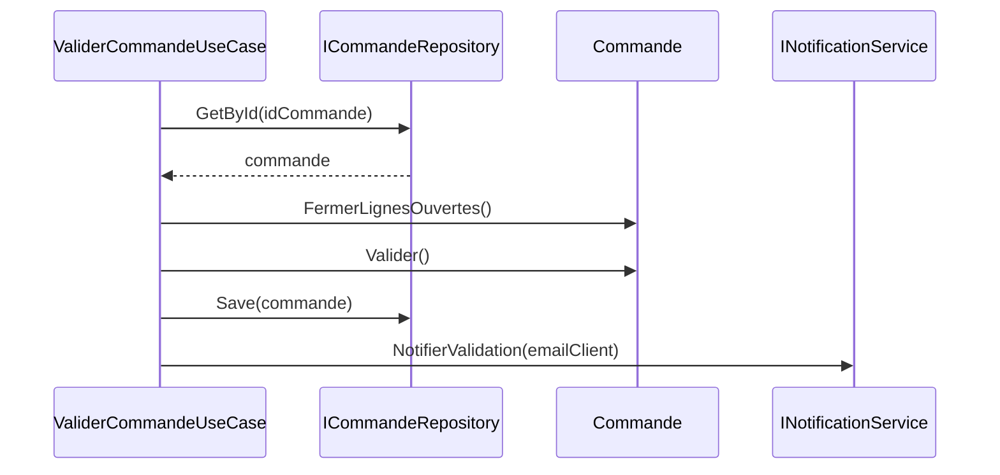

# Règles métier spécifiques à l'application dans les Cas d'Utilisation (Use Cases / Interactors)

Dans la Clean Architecture, les règles métier se répartissent entre les **entités** (règles d'entreprise) et les **cas d'utilisation** (règles spécifiques à l'application). Ces dernières traduisent la manière dont les entités sont exploitées pour répondre à des besoins fonctionnels précis dans le contexte de l'application.

---

## 1. Qu’est-ce que les règles métier spécifiques à l’application ?

Les règles métier spécifiques à l’application orchestrent la logique nécessaire pour accomplir une fonctionnalité définie par l’utilisateur ou le système. Elles répondent à la question :

> **Comment utiliser les entités pour réaliser un scénario métier particulier ?**

Aux différences des règles d’entreprise (stables et universelles), elles prennent en compte :

- Les processus métiers spécifiques.  
- Les contraintes temporaires ou contextuelles.  
- Les interactions avec les autres composants (ex. validation spécifique, gestion des droits).

Elles sont généralement implémentées dans des classes appelées *Use Cases* ou *Interactors*.

---

## 2. Rôle des Cas d'Utilisation

- **Orchestration** des appels aux entités et services métiers.  
- **Encapsulation** de scénarios métier précis (ex. passer une commande, inscrire un utilisateur).  
- **Isolation** : elles ne doivent pas dépendre d’infrastructures externes (UI, base de données).  
- **Clarté dans la logique** : un cas d’utilisation représente une action métier claire.

---

## 3. Exemple : cas d’utilisation `ValiderCommande`

Supposons une application de gestion de commandes :

- Règle d’entreprise : une commande ne peut pas être validée si elle est vide.  
- Règles de l’application : fermer les lignes de commande avant validation, notifier le client, mettre à jour l’état.

### Implémentation simplifiée en C#

```csharp
public class ValiderCommandeUseCase
{
    private readonly ICommandeRepository commandeRepository;
    private readonly INotificationService notificationService;

    public ValiderCommandeUseCase(ICommandeRepository commandeRepository, INotificationService notificationService)
    {
        this.commandeRepository = commandeRepository;
        this.notificationService = notificationService;
    }

    public void Exécuter(int idCommande)
    {
        var commande = commandeRepository.GetById(idCommande);

        // Règle spécifique : fermer les lignes ouvertes
        commande.FermerLignesOuvertes();

        // Valider la commande (règle d’entreprise)
        commande.Valider();

        commandeRepository.Save(commande);

        // Notifier le client (règle spécifique d’application)
        notificationService.NotifierValidation(commande.ClientEmail);
    }
}
```

---

## 4. Diagramme Mermaid illustrant l’interaction



---

## 5. Différences entre règles d’entreprise et règles spécifiques à l’application

| Aspect                    | Règles d’Entreprise (Entities)              | Règles spécifiques à l’application (Use Cases)      |
|--------------------------|---------------------------------------------|-----------------------------------------------------|
| Portée                  | Universelle, indépendante du contexte         | Contextuelle, liée aux besoins de l’application     |
| Niveau                   | Bas niveau, détails métier fondamentaux         | Haut niveau, orchestration de l’usage métier        |
| Dépendances             | Aucune dépendance aux infrastructures           | Peut dépendre d’abstractions (repos, services)       |
| Exemples                | Validation d’un état valide, calculs métier      | Envoyer notification, gérer processus, workflow     |

---

## 6. Bonnes pratiques

- Séparer clairement la logique métier pure (entités) de la logique spécifique à l’application (use cases).  
- Implémenter les use cases comme des classes ou services indépendants, facilement testables.  
- Injecter les dépendances (repositories, services) via interfaces pour respecter l’inversion des dépendances.  
- Limiter la responsabilité du use case à un seul scénario ou fonctionnalité métier.

---

## 7. Sources et références

- Robert C. Martin, *Clean Architecture*, 2017  
- Uncle Bob, [The Clean Architecture Explained](https://blog.cleancoder.com/uncle-bob/2012/08/13/the-clean-architecture.html)  
- Vladimir Khorikov, *Domain-Driven Design in .NET*, 2019  
- Microsoft Docs, [Use case interaction with entities](https://docs.microsoft.com/en-us/dotnet/architecture/modern-web-apps-azure/common-web-application-architectures#use-case-logic)  
- [Martin Fowler - Application Logic](https://martinfowler.com/bliki/ApplicationLogic.html)  

---

Les règles métier spécifiques à l’application orchestrent les entités pour réaliser les besoins fonctionnels précis. Cette séparation garantit une architecture claire et évolutive, où le cœur métier reste protégé des détails d’implémentation, tout en permettant à l’application de répondre efficacement aux scénarios réels.