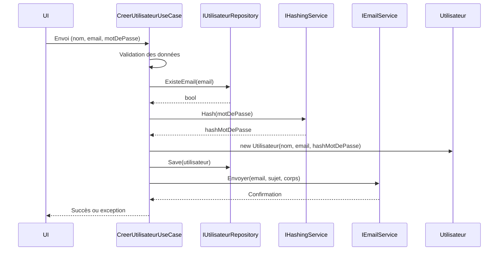

# Orchestration du flux de données dans les Cas d’Utilisation (Use Cases / Interactors)

Les cas d’utilisation (Use Cases ou Interactors) jouent un rôle central dans la Clean Architecture : ils orchestrent le **flux de données** entre les différentes couches et composants du système pour réaliser les objectifs métier spécifiques. Comprendre et maîtriser cette orchestration est essentiel pour garantir la clarté, la maintenabilité et la testabilité de la logique métier.

---

## 1. Qu'entend-on par orchestration du flux de données ?

Orchestrer le flux de données, c’est contrôler comment les informations circulent :

- Depuis les sources (interfaces utilisateur, API)  
- Vers les entités métier, infrastructures et services  
- En respectant la séquence logique des opérations métier

Cela inclut la transformation et validation des données, la coordination entre appels aux différents composants et la gestion des retours ou erreurs.

---

## 2. Rôle des Cas d’Utilisation dans cette orchestration

- Faire le **pont** entre les couches externes (UI, bases de données, services) et le domaine métier (entités).  
- Exécuter la **logique métier spécifique à l’application**, en combinant et en ordonnant les actions.  
- Garantir une **séparation claire des responsabilités** en centralisant le workflow métier.

---

## 3. Exemple simple : Orchestration pour `CréerUtilisateur`

Imaginons un cas d’utilisation qui crée un nouvel utilisateur dans une application.

### Étapes du flux de données :

1. Valider les données reçues (nom, email, mot de passe).  
2. Vérifier que l’email n’est pas déjà utilisé (via le repository).  
3. Hasher le mot de passe.  
4. Créer l’entité `Utilisateur`.  
5. Sauvegarder l’utilisateur.  
6. Envoyer un email de confirmation.

```csharp
public class CreerUtilisateurUseCase
{
    private readonly IUtilisateurRepository repository;
    private readonly IHashingService hashingService;
    private readonly IEmailService emailService;

    public CreerUtilisateurUseCase(IUtilisateurRepository repo, IHashingService hash, IEmailService email)
    {
        repository = repo;
        hashingService = hash;
        emailService = email;
    }

    public void Execute(string nom, string email, string motDePasse)
    {
        // 1. Validation de base
        if (string.IsNullOrWhiteSpace(nom) || string.IsNullOrWhiteSpace(email))
            throw new ArgumentException("Nom et email obligatoires");

        // 2. Vérifier unicité email
        if (repository.ExisteEmail(email))
            throw new InvalidOperationException("Email déjà utilisé");

        // 3. Hasher mot de passe
        var hashMotDePasse = hashingService.Hash(motDePasse);

        // 4. Créer utilisateur
        var utilisateur = new Utilisateur(nom, email, hashMotDePasse);

        // 5. Sauvegarder en base
        repository.Save(utilisateur);

        // 6. Envoyer email de confirmation
        emailService.Envoyer(email, "Bienvenue", "Merci pour votre inscription !");
    }
}
```

---

## 4. Diagramme Mermaid illustrant le flux de données



---

## 5. Bonnes pratiques pour l’orchestration du flux

- **Centraliser la gestion des règles métier spécifiques** dans les use cases.  
- **Respecter l’inversion des dépendances** : utiliser des interfaces pour les services / repositories permettant la substitution et le test.  
- **Garder les entités « pures »** : aucune logique spécifique à la gestion du flux ne doit y résider.  
- **Découper les use cases en opérations atomiques quand c’est possible**, et les composer si nécessaire.  
- **Gérer explicitement les cas d’erreur** et propager les exceptions ou codes retour adaptés.  
- **Écrire des tests unitaires ciblant le flux de données et les règles d’orchestration**.

---

## 6. Sources et références

- Robert C. Martin, *Clean Architecture*, 2017  
- Uncle Bob, [The Clean Architecture Explained](https://blog.cleancoder.com/uncle-bob/2012/08/13/the-clean-architecture.html)  
- Microsoft Docs, [Guidelines for managing business logic](https://docs.microsoft.com/en-us/dotnet/architecture/modern-web-apps-azure/common-web-application-architectures#business-logic)  
- Vaughn Vernon, *Implementing Domain-Driven Design*, 2013  
- Martin Fowler, [Service Layer](https://martinfowler.com/eaaCatalog/serviceLayer.html)  

---

L’orchestration du flux de données par les cas d’utilisation organise clairement les interactions essentielles entre services, entités et infrastructures. Elle permet d’écrire une logique métier concise, découplée et testable, tout en assurant la cohérence des processus dans l’application.