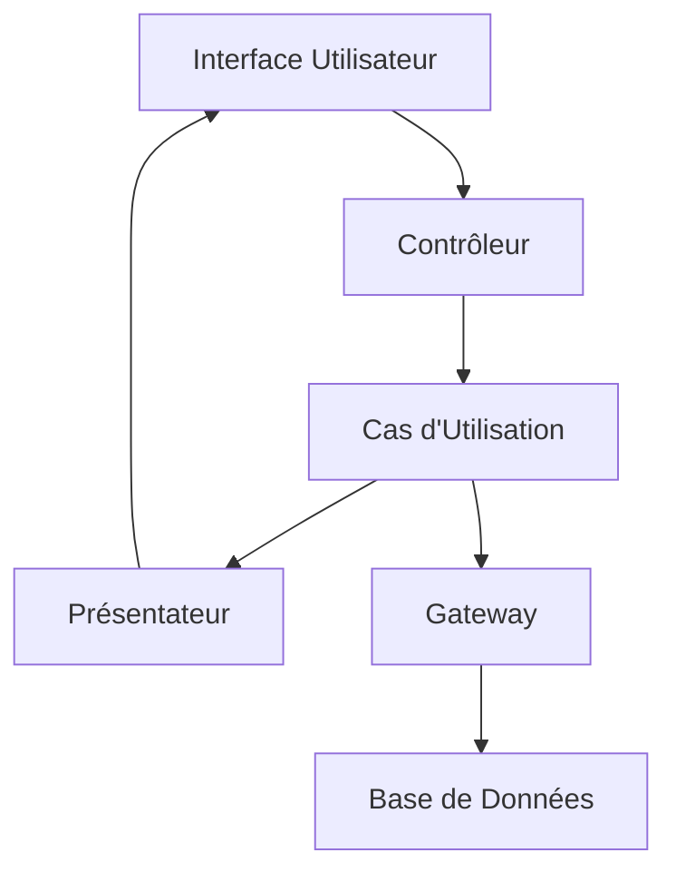

# Présentateurs, Gateways, Contrôleurs dans les Adaptateurs d'Interface de la Clean Architecture

Dans la Clean Architecture, les **adaptateurs d'interface** (Interface Adapters) jouent le rôle de traducteurs entre les couches internes (domaines métier, cas d'utilisation) et les couches externes (interfaces utilisateur, bases de données, services externes). Parmi ces adaptateurs, trois éléments clés structurent la communication : les **contrôleurs**, les **présentateurs** et les **gateways**.

---

## 1. Rôle des Adaptateurs d’Interface

Ils assurent la transformation des données entre formats adaptés aux couches métier et formats exploitables par les interfaces ou systèmes externes.

- **Contrôleurs** : réceptionnent les requêtes externes, adaptent les données puis délèguent aux cas d’utilisation.  
- **Présentateurs** : transforment les données métiers en formats adaptés à l’interface utilisateur (ex. DTO, vues).  
- **Gateways** : abstraient l’accès aux infrastructures externes (bases de données, services), transformant entre modèles externes et modèles métiers.

---

## 2. Contrôleurs

- Point d’entrée des interactions venant de l’interface utilisateur.  
- Peuvent être des controllers HTTP dans une API web, des handlers d’événements UI, etc.  
- Adaptent les entrées en requêtes utilisables par les Use Cases.  
- Exemple : un **Controller** qui reçoit une requête REST, extrait les paramètres, construit une requête métier puis invoque le Use Case correspondant.

```csharp
public class UtilisateurController
{
    private readonly ICreerUtilisateurUseCase useCase;

    public UtilisateurController(ICreerUtilisateurUseCase useCase)
    {
        this.useCase = useCase;
    }

    public IActionResult Creer(string nom, string email, string motDePasse)
    {
        try
        {
            useCase.Execute(nom, email, motDePasse);
            return new OkResult();
        }
        catch (Exception ex)
        {
            return new BadRequestObjectResult(ex.Message);
        }
    }
}
```

---

## 3. Présentateurs

- Transforme la sortie métier des use cases en données adaptées à la vue (UI).  
- Sépare la logique de présentation de la logique métier.  
- Expose souvent des **Data Transfer Objects (DTO)** ou ViewModels.  
- Exemple : convertir un objet `Utilisateur` en `UtilisateurViewModel` contenant uniquement les données nécessaires à l’interface.

```csharp
public class UtilisateurPresenter
{
    public UtilisateurViewModel Present(Utilisateur utilisateur)
    {
        return new UtilisateurViewModel
        {
            Nom = utilisateur.Nom,
            Email = utilisateur.EmailMasque() // méthode affichant partiellement l'email
        };
    }
}

public class UtilisateurViewModel
{
    public string Nom { get; set; }
    public string Email { get; set; }
}
```

---

## 4. Gateways

- Interface entre les cas d’utilisation et les infrastructures.  
- Gèrent la conversion entre modèles métiers et modèles techniques (ORM, API tiers).  
- Exposent des interfaces abstraites pour accéder aux données (repository pattern souvent utilisé).  
- Exemple : `IUtilisateurRepository` définissant des méthodes pour accéder à l’entité Utilisateur.

```csharp
public interface IUtilisateurRepository
{
    Utilisateur GetByEmail(string email);
    void Save(Utilisateur utilisateur);
}
```

Une implémentation concrète peut utiliser Entity Framework, Dapper ou des appels HTTP externes, mais reste transparente pour la couche Use Case.

---

## 5. Diagramme Mermaid illustrant la relation



---

## 6. Résumé du flux

1. **Contrôleur** reçoit une requête de l’utilisateur.  
2. Il adapte les données et appelle le **cas d’utilisation**.  
3. Le cas d’utilisation exécute la logique métier.  
4. Il utilise les **gateways** pour accéder ou modifier les données.  
5. Le cas d’utilisation renvoie un résultat métier.  
6. Le **présentateur** transforme ce résultat pour l’interface.  
7. La vue affiche les données formatées.

---

## 7. Sources et références

- Robert C. Martin, *Clean Architecture*, 2017  
- Uncle Bob, [The Clean Architecture Explained](https://blog.cleancoder.com/uncle-bob/2012/08/13/the-clean-architecture.html)  
- Microsoft Docs, [Clean Architecture and the Dependency Rule](https://docs.microsoft.com/en-us/azure/architecture/guide/architecture-styles/clean-architecture)  
- Vaughn Vernon, *Implementing Domain-Driven Design*, 2013  
- Simon Brown, *Software Architecture for Developers*, 2014  

---

La séparation claire des rôles de contrôleurs, présentateurs et gateways garantit une architecture modulaire où chaque composant reste simple, testable, et remplaçable. C’est ainsi que l’adaptateur d’interface facilite l’interopérabilité entre la logique métier immuable et les technologies changeantes de l’interface et des systèmes externes.