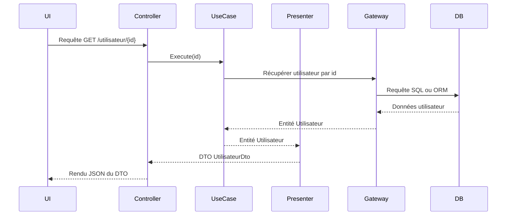

# Conversion de données entre les couches dans les Adaptateurs d'Interface de la Clean Architecture

Dans la Clean Architecture, les **adaptateurs d'interface** assurent la communication entre le domaine métier, les cas d’utilisation et les systèmes externes (interface utilisateur, bases de données, API externes). Une fonction clé de ces adaptateurs est la **conversion de données entre les couches**, transformant les modèles métiers en formats adaptés aux technologies utilisées par les couches externes, et inversement.

---

## 1. Pourquoi la conversion de données est-elle nécessaire ?

Chaque couche de l’architecture utilise des modèles différents :

- **Domaine métier** : entités riches, encapsulant règles et comportements.  
- **Cas d’utilisation** : objets métier ou requêtes métier, souvent abstraits.  
- **Interface utilisateur** : ViewModels, DTOs adaptés pour affichage ou interaction utilisateur.  
- **Infrastructure** : modèles de persistance (ORM), formats JSON pour APIs, structures propres aux APIs externes.

La conversion évite que ces modèles se mélangent, ce qui protège la cohérence métier et facilite l’évolution indépendante de chaque couche.

---

## 2. Types courants de conversion de données

### 2.1 Entités vers DTO ou ViewModels

Lorsqu’un cas d’utilisation retourne une entité métier, un **présentateur** convertit cette entité vers un **Data Transfer Object (DTO)** ou un **ViewModel** adapté à la couche de présentation.

Exemple :

```csharp
public UtilisateurViewModel Convertir(Utilisateur utilisateur)
{
    return new UtilisateurViewModel
    {
        Nom = utilisateur.Nom,
        Email = utilisateur.EmailMasque()
    };
}
```

### 2.2 Données d’entrée vers requêtes métier

Un **contrôleur** transforme souvent les données reçues (JSON, formulaire, paramètres HTTP) en objets métiers ou requêtes pour les cas d’utilisation.

```csharp
var requete = new CreerUtilisateurRequete(nom, email, motDePasse);
useCase.Execute(requete);
```

### 2.3 Modèles métiers vers modèles de persistance

Le **gateway** convertit les entités métiers en modèles compatibles avec l’ORM, base de données ou service tiers, et inversement.

---

## 3. Exemple complet de conversion dans un flux

Imaginons un système qui affiche les détails d’un utilisateur :

- Entité métier : `Utilisateur` avec logique métier.  
- DTO/presenter : `UtilisateurDto` exposant uniquement les données nécessaires.  
- Contrôleur : reçoit un id utilisateur, demande au Use Case.  
- Gateway : récupère les données sur la base.

```csharp
// Entité
public class Utilisateur 
{
    public string Nom { get; private set; }
    public string Email { get; private set; }
    public string EmailMasque() => Email.Replace("@", " [at] ");
}

// DTO
public class UtilisateurDto 
{
    public string Nom { get; set; }
    public string Email { get; set; }
}

// Présentateur
public class UtilisateurPresenter
{
    public UtilisateurDto Présenter(Utilisateur utilisateur) => new UtilisateurDto
    {
        Nom = utilisateur.Nom,
        Email = utilisateur.EmailMasque()
    };
}

// Contrôleur
public class UtilisateurController
{
    private readonly IGetUtilisateurUseCase useCase;
    private readonly UtilisateurPresenter presenter;

    public UtilisateurController(IGetUtilisateurUseCase useCase, UtilisateurPresenter presenter)
    {
        this.useCase = useCase;
        this.presenter = presenter;
    }

    public IActionResult GetUtilisateur(int id)
    {
        var utilisateur = useCase.Execute(id);
        var dto = presenter.Présenter(utilisateur);
        return new JsonResult(dto);
    }
}
```

---

## 4. Diagramme Mermaid illustrant la conversion



---

## 5. Bonnes pratiques

- **Isoler la conversion** dans des classes dédiées (présentateurs, mappers).  
- **Ne pas exposer directement les entités métier** à la couche UI ou externe.  
- Respecter la **responsabilité unique** : chaque convertisseur ne fait que transformer les données, sans ajouter de logique métier.  
- Utiliser des bibliothèques comme **AutoMapper** quand elle simplifie, mais rester vigilant sur la lisibilité et performance.  
- Valider les données à chaque conversion, surtout en entrée.

---

## 6. Sources et références

- Robert C. Martin, *Clean Architecture*, 2017  
- Microsoft Docs, [Managing Domain Models](https://learn.microsoft.com/en-us/dotnet/architecture/modern-web-apps-azure/common-web-application-architectures)  
- Martin Fowler, [Data Transfer Object](https://martinfowler.com/eaaCatalog/dataTransferObject.html)  
- Jimmy Bogard, *AutoMapper* documentation (https://automapper.org)  
- Simon Brown, *Clean Architecture with .NET Core*, 2020  

---

La conversion des données entre couches assure la cohérence du système tout en permettant une évolutivité et un découplage fort. Bien maîtrisée, elle facilite l’adaptation de l’application face aux changements technologiques et aux besoins fonctionnels.