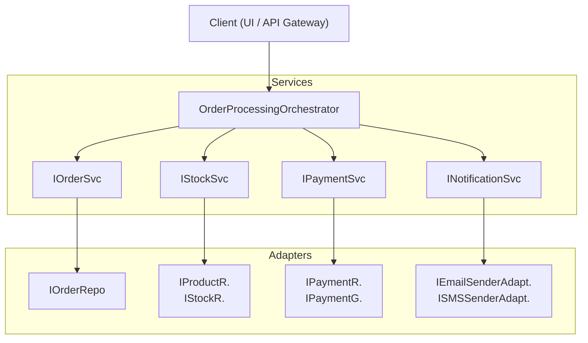
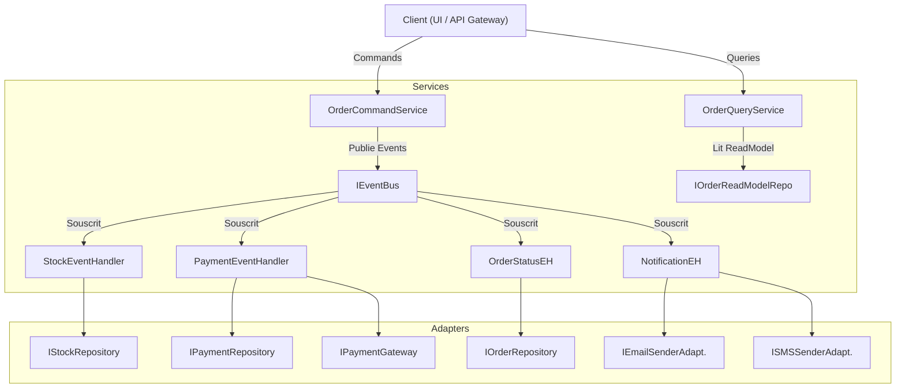

Voici deux solutions pour le TP de conception de composants pour le traitement de commandes client, chacune adoptant une approche architecturale distincte.

---

### Chapitre 1 : Approche Orientée Services et Couches

Cette solution propose une architecture structurée autour de services métier distincts, organisés en couches, où chaque composant a une responsabilité claire et communique via des interfaces bien définies.

#### 1. Analyse de la Fonctionnalité

Le traitement d'une commande client est un processus métier critique et transactionnel.

*   **Étapes clés :**
    1.  **Réception et validation initiale :** La commande est acceptée et son statut est "En attente".
    2.  **Vérification de la disponibilité du stock :** Pour chaque article, le stock est vérifié. Si insuffisant, la commande est mise en échec ou en attente d'approvisionnement.
    3.  **Réservation du stock :** Si disponible, le stock est réservé pour la commande.
    4.  **Initiation du paiement :** Une transaction de paiement est lancée auprès d'un fournisseur externe.
    5.  **Confirmation du paiement :** Attente du résultat du paiement.
    6.  **Mise à jour du stock :** Si le paiement est réussi, le stock est décrémenté de manière permanente.
    7.  **Mise à jour du statut de la commande :** Le statut passe à "Payée" et "Traitée" (ou "Annulée" en cas d'échec).
    8.  **Notifications :** Envoi de confirmations au client et d'alertes aux équipes internes (logistique).
    9.  **Gestion des erreurs et compensations :** En cas d'échec à une étape (paiement refusé, stock insuffisant), des actions compensatoires sont déclenchées (libération du stock réservé, annulation de la commande).

*   **Entités métier principales :**
    *   `Order` (Commande) : Représente la commande client avec ses détails (articles, client, statut).
    *   `OrderItem` (Ligne de commande) : Un article spécifique dans une commande.
    *   `Product` (Produit) : Informations sur le produit (prix, description).
    *   `Stock` : Quantité disponible d'un produit.
    *   `Customer` (Client) : Informations sur le client.
    *   `PaymentTransaction` (Transaction de paiement) : Détails d'une tentative de paiement.
    *   `Notification` : Message à envoyer.

#### 2. Conception de la Structure de Composants

Nous proposons une décomposition en services métier, chacun gérant un domaine spécifique, orchestrés par un service de plus haut niveau.

*   **`OrderProcessingOrchestrator`**
    *   **Rôle :** Coordonne l'ensemble du flux de traitement. Il est responsable de la séquence des appels aux autres services et de la gestion des logiques de compensation en cas d'échec.
    *   **Dépendances :** `IStockService`, `IPaymentService`, `IOrderService`, `INotificationService`.
*   **`IOrderService` / `OrderService`**
    *   **Rôle :** Gère le cycle de vie des commandes (création, récupération, mise à jour du statut).
    *   **Dépendances :** `IOrderRepository`.
*   **`IStockService` / `StockService`**
    *   **Rôle :** Gère la vérification, la réservation et la décrémentation/libération du stock.
    *   **Dépendances :** `IProductRepository`, `IStockRepository`.
*   **`IPaymentService` / `PaymentService`**
    *   **Rôle :** Gère l'interaction avec les fournisseurs de paiement externes (initiation, capture, remboursement).
    *   **Dépendances :** `IPaymentGatewayAdapter`, `IPaymentRepository`.
*   **`INotificationService` / `NotificationService`**
    *   **Rôle :** Envoie des notifications (email, SMS) aux clients ou administrateurs.
    *   **Dépendances :** `IEmailSenderAdapter`, `ISMSSenderAdapter`.
*   **`IProductRepository` / `IOrderRepository` / `IStockRepository` / `IPaymentRepository`**
    *   **Rôle :** Interfaces et implémentations pour la persistance des entités correspondantes. Abstraient les détails de la base de données.
    *   **Dépendances :** Base de données (via un ORM ou un pilote).
*   **`IPaymentGatewayAdapter` / `IEmailSenderAdapter` / `ISMSSenderAdapter`**
    *   **Rôle :** Interfaces et implémentations pour interagir avec des systèmes externes spécifiques (API de paiement, service d'envoi d'emails).
    *   **Dépendances :** API externes.

**Diagramme de Composants :**

#### 3. Justification des Choix Architecturaux

*   **Cohésion :** Chaque service (ex: `StockService`, `PaymentService`) a une forte cohésion. Il encapsule toute la logique et les données nécessaires à la gestion de son domaine spécifique. Cela respecte le Principe de Responsabilité Unique (SRP), car chaque service a une seule raison de changer (ex: une modification des règles de stock n'affecte que `StockService`).

*   **Couplage :** Le couplage est faible grâce à l'utilisation systématique d'interfaces (ex: `IStockService`, `IPaymentGatewayAdapter`) et à l'injection de dépendances. Les composants de haut niveau (`OrderProcessingOrchestrator`) dépendent des abstractions des services de bas niveau, et non de leurs implémentations concrètes (Principe d'Inversion de Dépendance - DIP).

*   **Modularité :** La décomposition en services distincts rend le système hautement modulaire. Une modification dans la logique de paiement (ex: changement de fournisseur) est isolée à `PaymentService` et son adaptateur, sans impacter les autres services.

*   **Réutilisation :** Les services comme `StockService` ou `NotificationService` sont génériques et peuvent être réutilisés par d'autres fonctionnalités de l'application (ex: gestion d'inventaire, envoi de newsletters). Les adaptateurs sont également réutilisables pour d'autres interactions avec les systèmes externes.

*   **Compromis :** L'orchestrateur (`OrderProcessingOrchestrator`) a une cohésion légèrement plus faible car il coordonne plusieurs domaines. Cependant, cette responsabilité d'orchestration est essentielle pour gérer le flux métier complexe et les compensations transactionnelles. Sa responsabilité est clairement définie : orchestrer, pas exécuter la logique métier des autres domaines.

#### 4. Scénario d'Évolution

*   **Intégration d'un nouveau mode de paiement (ex: cryptomonnaie) :**
    *   Créer une nouvelle implémentation de `IPaymentGatewayAdapter`, par exemple `CryptoPaymentGatewayAdapter`, qui gère l'API spécifique de la cryptomonnaie.
    *   Modifier `PaymentService` (ou introduire une fabrique) pour qu'il puisse choisir dynamiquement l'adaptateur approprié en fonction du type de paiement de la commande.
    *   Aucune modification n'est nécessaire dans `OrderProcessingOrchestrator` ou d'autres services, car ils dépendent de l'abstraction `IPaymentService` (Principe Ouvert/Fermé - OCP).

*   **Intégration d'un nouveau service de livraison :**
    *   Ajouter un nouveau service `IDeliveryService` / `DeliveryService` et son `IDeliveryGatewayAdapter` correspondant.
    *   `OrderProcessingOrchestrator` serait étendu pour appeler ce nouveau `IDeliveryService` après que la commande est payée et le stock décrémenté. Les services existants (stock, paiement, notification) restent inchangés. Cela démontre l'OCP pour les services existants, et une extension contrôlée de l'orchestrateur.

---

### Chapitre 2 : Approche CQRS et Événementielle

Cette solution adopte une approche plus avancée, séparant les responsabilités de commande (modification de l'état) et de requête (lecture de l'état) (CQRS), et utilisant un bus d'événements pour découpler les composants de manière asynchrone.

#### 1. Analyse de la Fonctionnalité

Les étapes et entités sont similaires à la Solution 1, mais l'accent est mis sur la nature asynchrone et la séparation des modèles de lecture et d'écriture.

*   **Étapes clés :**
    1.  **Réception de la commande (Commande) :** Une `PlaceOrderCommand` est reçue.
    2.  **Validation et publication d'événement :** La commande est validée et un `OrderPlacedEvent` est publié.
    3.  **Réaction au stock (Événement) :** Un gestionnaire d'événements de stock (`StockEventHandler`) écoute `OrderPlacedEvent`, vérifie et réserve le stock, puis publie `StockReservedEvent` ou `StockFailedEvent`.
    4.  **Réaction au paiement (Événement) :** Un gestionnaire d'événements de paiement (`PaymentEventHandler`) écoute `StockReservedEvent`, initie le paiement, puis publie `PaymentSuccessfulEvent` ou `PaymentFailedEvent`.
    5.  **Mise à jour du statut de la commande (Événement) :** Un gestionnaire d'événements de statut (`OrderStatusEventHandler`) écoute les événements de paiement et de stock pour mettre à jour le statut de la commande.
    6.  **Notifications (Événement) :** Un gestionnaire d'événements de notification (`NotificationEventHandler`) écoute les événements pertinents (paiement réussi, commande annulée) pour envoyer des messages.
    7.  **Mise à jour des modèles de lecture :** Des gestionnaires spécifiques mettent à jour des modèles de données optimisés pour la lecture en réaction aux événements.

*   **Entités métier principales :** `Order`, `Product`, `Stock`, `Customer`, `PaymentTransaction`.
    *   **Commandes :** `PlaceOrderCommand`, `CancelOrderCommand`.
    *   **Requêtes :** `GetOrderByIdQuery`, `GetCustomerOrdersQuery`.
    *   **Événements :** `OrderPlacedEvent`, `StockReservedEvent`, `StockFailedEvent`, `PaymentSuccessfulEvent`, `PaymentFailedEvent`, `OrderCancelledEvent`.

#### 2. Conception de la Structure de Composants

Cette approche sépare les responsabilités de modification (Commandes) des responsabilités de lecture (Requêtes) et utilise un bus d'événements pour une communication asynchrone et découplée.

*   **`OrderCommandService` (Command Handler)**
    *   **Rôle :** Reçoit des `Commands` (ex: `PlaceOrderCommand`). Valide la commande, interagit avec le modèle d'écriture (via `IOrderRepository`), et publie des `Events` sur le bus.
    *   **Dépendances :** `IOrderRepository` (écriture), `IEventBus`.
*   **`OrderQueryService` (Query Handler)**
    *   **Rôle :** Reçoit des `Queries` (ex: `GetOrderByIdQuery`). Lit des données à partir d'un modèle de lecture optimisé.
    *   **Dépendances :** `IOrderReadModelRepository`.
*   **`IEventBus`**
    *   **Rôle :** Mécanisme de publication/souscription pour les événements. Permet une communication asynchrone et découplée entre les composants.
*   **`StockEventHandler`**
    *   **Rôle :** Souscrit à `OrderPlacedEvent`. Vérifie la disponibilité et réserve/décrémente le stock via `IStockRepository`. Publie `StockReservedEvent` ou `StockFailedEvent`.
    *   **Dépendances :** `IStockRepository` (écriture), `IEventBus`.
*   **`PaymentEventHandler`**
    *   **Rôle :** Souscrit à `StockReservedEvent`. Initie le paiement via `IPaymentGatewayAdapter`. Publie `PaymentSuccessfulEvent` ou `PaymentFailedEvent`.
    *   **Dépendances :** `IPaymentGatewayAdapter`, `IPaymentRepository` (écriture), `IEventBus`.
*   **`OrderStatusEventHandler`**
    *   **Rôle :** Souscrit à `PaymentSuccessfulEvent`, `PaymentFailedEvent`, `StockFailedEvent`. Met à jour le statut de la commande via `IOrderRepository`.
    *   **Dépendances :** `IOrderRepository` (écriture).
*   **`NotificationEventHandler`**
    *   **Rôle :** Souscrit à `PaymentSuccessfulEvent`, `OrderCancelledEvent`, etc. Envoie des notifications.
    *   **Dépendances :** `IEmailSenderAdapter`, `ISMSSenderAdapter`.
*   **`IOrderRepository` (écriture) / `IStockRepository` (écriture) / `IPaymentRepository` (écriture)**
    *   **Rôle :** Interfaces et implémentations pour la persistance des données d'écriture.
*   **`IOrderReadModelRepository`**
    *   **Rôle :** Interface et implémentation pour la persistance d'un modèle de données optimisé pour la lecture des commandes (peut être dénormalisé, distinct du modèle d'écriture).
*   **`IPaymentGatewayAdapter` / `IEmailSenderAdapter` / `ISMSSenderAdapter`**
    *   **Rôle :** Interfaces et implémentations pour interagir avec des systèmes externes.

**Diagramme de Composants :**

#### 3. Justification des Choix Architecturaux

*   **Cohésion :** Chaque composant a une cohésion très forte. Les `Command Handlers` gèrent l'exécution d'une commande spécifique. Les `Query Handlers` gèrent la récupération de données. Les `Event Handlers` réagissent à un type d'événement pour effectuer une tâche spécifique (ex: `StockEventHandler` gère *uniquement* la logique de stock en réponse aux événements). Cela renforce le SRP.

*   **Couplage :** Le couplage est extrêmement faible. Les composants communiquent principalement via le `IEventBus`. Un composant publie un événement sans savoir qui y souscrit, et les souscripteurs réagissent sans connaître l'émetteur. Cela réduit le couplage temporel et direct, favorisant l'indépendance (DIP).
    
*   **Modularité :** Exceptionnelle. L'ajout d'un nouveau comportement (ex: un programme de fidélité qui récompense les commandes) se fait en ajoutant un nouvel `EventHandler` qui souscrit aux événements existants (ex: `PaymentSuccessfulEvent`), sans modifier les composants actuels (OCP).

*   **Réutilisation :** Les `Event Handlers` et les adaptateurs sont très réutilisables. Le bus d'événements lui-même est un composant central réutilisable. Les modèles de lecture peuvent être réutilisés par différentes interfaces utilisateur.

*   **Compromis :** La complexité initiale est plus élevée en raison de la gestion des événements (transactionnalité, idempotence, ordre des événements) et de la séparation des modèles de lecture/écriture. Cela nécessite une courbe d'apprentissage plus raide. Cependant, pour des systèmes à forte évolutivité, des exigences de lecture/écriture très différentes, ou des domaines métier complexes, ces compromis sont justifiés par la flexibilité et la résilience accrues.

#### 4. Scénario d'Évolution

*   **Intégration d'un nouveau mode de paiement (ex: cryptomonnaie) :**
    *   Créer un nouvel `CryptoPaymentGatewayAdapter` implémentant `IPaymentGatewayAdapter`.
    *   Modifier `PaymentEventHandler` pour qu'il puisse choisir l'adaptateur approprié (via une stratégie ou une fabrique) en fonction du type de paiement inclus dans l'événement `StockReservedEvent`.
    *   Les autres `Event Handlers` et le `OrderCommandService` ne sont pas affectés, car ils ne se soucient pas des détails d'implémentation du paiement.

*   **Intégration d'un nouveau service de livraison :**
    *   Ajouter un `DeliveryEventHandler` qui souscrit à `PaymentSuccessfulEvent` (ou un événement `OrderReadyForDeliveryEvent` publié par `OrderStatusEventHandler` une fois la commande entièrement traitée).
    *   Ce nouvel `EventHandler` utiliserait un `IDeliveryGatewayAdapter` pour interagir avec le service de livraison.
    *   Aucun composant existant n'a besoin d'être modifié, seulement ajouté. C'est un exemple parfait du Principe Ouvert/Fermé (OCP).